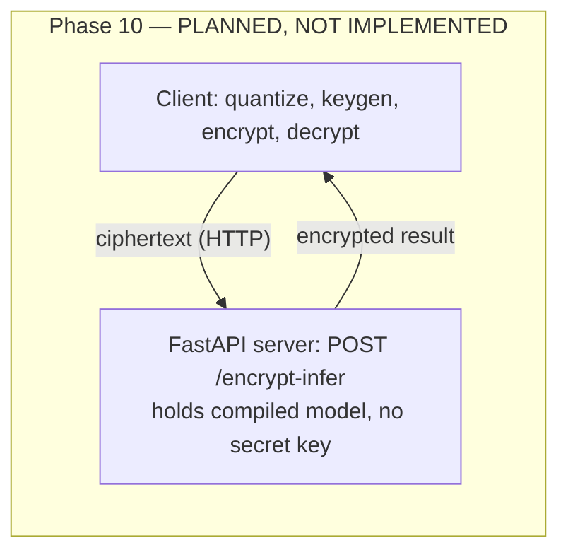
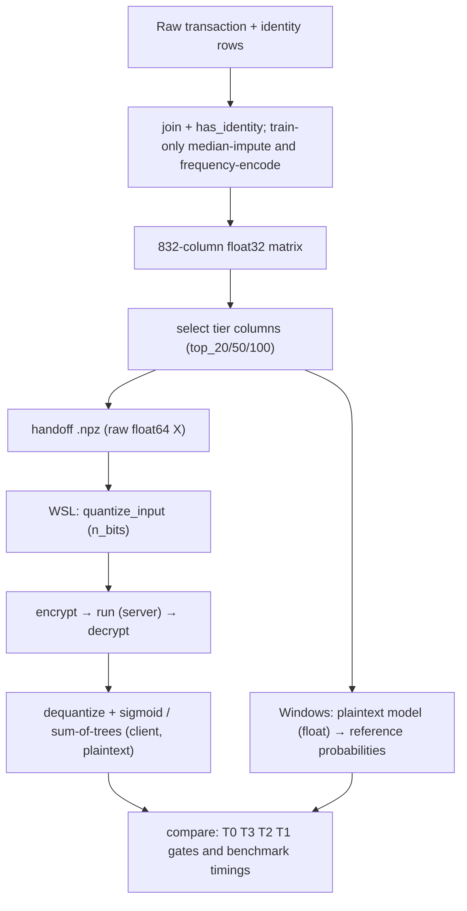
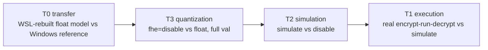

# Ciphraud — Complete Technical Audit and Historical Reconstruction

**Project:** Ciphraud — Latency-Bounded Privacy-Preserving Fraud Detection Under FHE
**Audit snapshot:** 2026-09-25, ~00:20 IST (repository at commit `e85d16a`, working tree dirty — see §13). **The body reflects this snapshot; later developments (LR scaler defect fixed and verified; Phase 8 completed with Pareto analysis and prior-art comparison; Phase 9 quantized MLP grid completed) are in Addenda A, B and C at the end, which supersede the body where they differ (Addendum C is the newest).**
**Method:** read-only inspection of source, configs, docs, results, git history, and file timestamps; a few small read-only numerical checks (listed in Appendix A). Nothing in the project was modified by this audit except the addition of this report (`Ciphraud_Project_Audit.md`, `Ciphraud_Project_Audit.docx`).

---

## How to read this report

Every statement is tagged, or sits under a heading that is tagged, with one of these status labels:

| Tag | Meaning |
|---|---|
| **[IMPLEMENTED]** | Code exists in the repository and was actually run (evidence cited). |
| **[PARTIAL]** | Exists but incomplete, or works only under stated limits. |
| **[PLANNED]** | Described in `docs/` (usually `docs/plan.md`) but no implementation exists. |
| **[FAILED]** | Attempted; the attempt failed or its acceptance gate was not met. |
| **[CONSIDERED]** | Discussed or evaluated in the docs, never implemented. |
| **Not verified / Unknown** | The evidence needed to confirm the statement is not available in the project files. |

Evidence sources used, in decreasing order of strength: (1) code and result files I opened in this audit; (2) numbers recomputed in this audit; (3) statements in `docs/*.md` and config comments (written by earlier sessions; cross-checked where possible); (4) the working-session record of Phase 7–8 (code comments, commit messages, conversation history). Where a statement rests only on (3) or (4) it is marked as such.

**Tests were deliberately *not* re-run in this audit.** A long FHE latency measurement (`xgboost_top50_bits14`) was executing in WSL2 on the same 6 CPUs while this audit was written, and running the test suite would have distorted its timings. All test counts below are therefore *recorded* results, not fresh ones.

---

## 0. Headline findings of the audit (read this first)

1. **The Logistic-Regression FHE path omits the `StandardScaler`, and this — not quantization resolution — appears to explain every LR "T3 failure" recorded so far. [Newly discovered in this audit. UPDATE: fixed and verified after the snapshot — see Addendum A.1.]**
   The plaintext LR model is `Pipeline(StandardScaler → LogisticRegression)`. The exported handoff stores **raw** feature matrices (`src/fhe/export.py:156-157`) together with the **standardized-space** coefficients (`lr_coef`). `build_concrete_lr` (`src/fhe/compile/linear.py:42-52`) copies those coefficients into a plain LR with no scaler, and `src/fhe/poc.py:152` / `src/benchmark/run.py:83` compile it on raw `X_train` and evaluate it on raw `X_val`. The compiled model therefore computes `σ(w·x_raw + b)` instead of `σ(w·(x−μ)/s + b)`.
   *Verification (numpy only, no Concrete-ML, real Phase 5 handoff):* `σ(w·x_raw + b)` on val gives **PR-AUC 0.0583, ROC-AUC 0.5846, decision agreement with the reference 0.9615**; the Phase 5 `n_bits=16` T3 run measured **0.0583 / 0.5836 / 0.9614**. The correctly scaled computation reproduces the stored reference exactly (max |Δ| = 0.0). The `n_bits=8` quantized numbers (0.0554 / 0.5701 / 0.9576) are the same wrong function plus quantization noise.
   *Consequences:* the diagnosis in `docs/fhe_poc.md` §8–9 ("uniform min/max quantization wastes levels on heavy-tailed columns") is **not supported** for LR; the claim in `docs/fhe_xgboost.md` §7 and `docs/plan.md` that Phase 6 "independently reproduces the Phase 5 LR quantization finding" is unsupported for its LR half; all six LR accuracy results in Phase 8 (T3, quantized PR-AUC) are contaminated. What is *not* affected: XGBoost (trees have no scaler), T0/T1/T2 for LR (they check the circuit against the clear-quantized version of the *same* function), and PBS = 0. Details and proposed fix: §10 Problem 15.
2. **No user-facing system exists.** There is no client, no server, no API, no frontend, no database, no authentication, no Docker. `src/client/`, `src/server/`, `src/analysis/` contain only empty `__init__.py`. Encrypted inference has only been exercised inside one Python process (one trust domain), so the project's security claim is **not demonstrated** anywhere (§6).
3. **Phases 0–7 are committed; Phase 8 is ~half done, uncommitted, and running.** 7 of 12 Phase-8 configurations have final results; the 8th (`xgboost_top50_bits14`) is mid-run; 4 XGBoost configurations have not started.
4. **The accuracy gate T3 has failed on every one of the 9 distinct model × tier × bit-width configurations measured so far** (LR: top_20/50/100 × 8/16 bits; XGBoost: top_20/50/100 × 8 bits; Phase 8 re-measurements of Phase 5/6 configurations agree with the originals). For XGBoost this is a plausible genuine quantization effect (neither disproven nor confirmed yet; `xgboost_top50_bits14` will be the first XGBoost datapoint at a second bit-width); for LR see finding 1.
5. **Measured FHE XGBoost latency is 12–76 minutes per row**, versus the ~6 ms cited in `docs/prd.md` §11 as prior art. The divergence has not yet been analysed (that is a Phase 8 deliverable).
6. **Three process/traceability gaps to be aware of:** (a) three *committed Phase 7* files are modified in the working tree (additive, backward-compatible, but literally edits to Phase 7 code); (b) Phase 8 `provenance.json` records `git_commit = e85d16a` although the Phase 8 code was uncommitted when it ran; (c) Phase 8 `metrics.json` has no per-entry `config_hash`. See §13.
7. **No test-set evaluation has ever been run (by design).** Every reported PR-AUC is a *validation* number, and validation data was also used for early stopping, threshold selection and tier evaluation, so all of them are mildly optimistic (§5).

---

## 1. Project overview

### 1.1 What Ciphraud is

A research-style project studying **fraud detection on encrypted data**. The intended system: a client encrypts a transaction's features with Fully Homomorphic Encryption (FHE), an *untrusted* inference server evaluates a trained model directly on the ciphertext, and only the client (secret-key holder) can decrypt the fraud score. The project is explicitly framed as **reproduce-and-extend** — not a claim of novelty (`docs/prd.md` §1).

**Central research question** (`docs/prd.md` §1, `CLAUDE.md` §1):
> How do feature count, quantization bit-width, and ML model complexity affect the predictive performance and computational cost of privacy-preserving fraud detection under FHE?

### 1.2 Problem it tries to solve

A bank/PSP/fraud vendor wants ML fraud scoring from a provider it does not fully trust with plaintext transaction data. The single narrow claim the project wants to make (`docs/architecture.md` §10): *an honest, hardware-untrusted inference server cannot recover plaintext features or the plaintext decision from what it receives.* It deliberately does **not** claim model confidentiality, protection from timing/volume side channels, malicious-server (result-tampering) resistance, multi-party collaboration, or any regulatory compliance.

### 1.3 Intended users

- Real-world illustrative user: a fraud-detection vendor or bank (`docs/prd.md` §3).
- Actual audience: ML-internship and graduate-admissions reviewers evaluating a portfolio artifact; secondary: future readers wanting a benchmark of FHE cost vs. model complexity.
- Solo developer, undergraduate; the coding agent (Claude Code) implements while the developer learns (`CLAUDE.md` §16).

### 1.4 Core idea

Train plaintext models on the IEEE-CIS Fraud Detection data under a leakage-safe, time-based protocol → rank features → define feature-count tiers (top-20/50/100) → quantize and compile each model with Zama **Concrete-ML** into an FHE circuit → validate the circuit against plaintext → benchmark latency/memory/ciphertext size over a `model × tier × bit-width` grid → report Pareto frontiers.

### 1.5 Technologies actually used

| Area | Technology (version) | Where |
|---|---|---|
| Language | Python 3.12.0 (Windows), 3.12.3 (WSL2) | `docs/environment.md` |
| Data / ML (Windows `.venv`) | numpy 2.5.3, pandas 3.0.5, scikit-learn 1.9.0, xgboost 3.4.1, PyYAML 6.0.3, pytest 9.1.1, matplotlib 3.11.1 | `requirements.txt` |
| FHE (WSL2 venv only) | concrete-ml 1.9.0, concrete-python 2.10.0, concrete-ml-extensions 0.1.9, numpy 1.26.4, scikit-learn 1.5.0, xgboost 1.6.2, torch 2.3.1, brevitas 0.10.2 (installed, unused so far), onnx 1.17.0 | `requirements-fhe.txt` (full `pip freeze`) |
| Platform | Windows 11 Pro N (10.0.22621) host; WSL2 Ubuntu 24.04.4 LTS for FHE | `docs/environment.md` |
| Hardware | Intel Core i5-9500 @ 3.00 GHz, 6 cores / 6 logical, 7.95 GB RAM (WSL2 gets 3.8 GiB + 1 GiB swap) | `docs/environment.md` |
| Config | YAML, versioned per phase (`configs/phaseN/`) | `src/config.py` |
| Logging | JSON structured logging | `src/logging_setup.py` |
| Integrity | SHA-256 (`hashlib`) for data files, handoff arrays, model files, tier membership | several modules |
| Planned, **not present**: FastAPI, Docker, MLP/Brevitas training | — | `docs/architecture.md` §6–7, §18, §21 |

### 1.6 Current development status

| Phase (from `docs/plan.md`) | Status | Evidence |
|---|---|---|
| 0 Environment & repo | **Complete**, committed | commit `6fceae3`, `docs/environment.md` |
| 1 Dataset & EDA | **Complete**, committed | commits `54eb9ac`, `b3fa1e8`; `results/phase1_eda/` |
| 2 Leakage-safe pipeline | **Complete**, committed | commit `8732dcb`; `results/phase2_pipeline/` |
| 3 Baseline models | **Complete**, committed (+ bug-fix commit) | `5fe2dcf`, `8c3fd3d` |
| 4 Feature selection / tiers | **Complete**, committed | `f8e8bfe` |
| 5 FHE PoC (LR) | **Closed** per its literal exit criterion (T1 pass); accuracy gate T3 failed; *diagnosis now in doubt* (§0.1) | `fe66aef` |
| 6 FHE XGBoost (3 tiers @ 8 bits) | **Closed** per exit criterion; T3 failed for all tiers | `51962e2` |
| 7 Benchmark infrastructure | **Complete**, committed; smoke test passed | `e85d16a` |
| 8 Core research experiments | **In progress, uncommitted** — 7/12 configs done, 1 running, 4 not started; no Pareto analysis, no `docs/research.md` yet | working tree |
| 9 Quantized MLP | **[PLANNED]** — not started | no MLP code exists |
| 10 Client/server (FastAPI) | **[PLANNED]** — not started | `src/client`, `src/server` empty |
| 11 Docker/API polish | **[PLANNED]** — not started | no Dockerfile |
| 12 Final report | **[PLANNED]** — `report.md` does not exist | — |
| 13 GitHub/resume polish | **[PLANNED]** — no `README.md` exists | — |

---

## 2. Everything built so far — component by component

Two cross-cutting conventions apply to almost every component: (1) each phase is driven by a versioned YAML config and writes a `provenance.json` (config hash, git commit, timestamp, library versions); (2) the test partition is never read (recorded as `"test_partition_touched": false` in metrics files).

### 2.1 Configuration, logging, provenance utilities — [IMPLEMENTED]

- **Purpose:** central, non-hardcoded config loading; structured logs; traceability stamp for every result.
- **Files:** `src/config.py` (`load_config`, `get_env`, `ConfigError`), `src/logging_setup.py` (`JsonFormatter`, `get_logger`), `src/data/provenance.py` (`get_git_commit`, `get_library_versions`, `compute_config_hash`, `build_provenance`).
- **How it works:** `load_config` reads YAML relative to the configs dir with a CWD-relative fallback; `compute_config_hash` = first 16 hex chars of SHA-256 over canonical JSON; `build_provenance` records config hash, path, git commit, UTC timestamp, seed, library versions, raw-file digests.
- **Tests:** `tests/test_config.py`, `tests/test_logging_setup.py`, `tests/test_environment_smoke.py`, `tests/test_fhe_environment_smoke.py`.
- **Limitations:** `git_commit` is `HEAD` at run time, so it is misleading when the tree is dirty (§13, item 2). `load_config`'s path resolution double-prefixes `configs/` and silently falls back to CWD (`docs/features.md` §6.2) — worked around in tests, not fixed.

### 2.2 Raw-data loading and schema validation — [IMPLEMENTED]

- **Purpose:** ingest the two IEEE-CIS CSVs safely and verify they are the expected files.
- **Files:** `src/data/load.py` (`read_header`, `infer_dtype_map`, `iter_chunks`, `load_full`, `compute_file_digest`, `resolve_raw_paths`, `verify_or_report_digest`), `src/data/schema.py` (validators).
- **Inputs:** `data/raw/train_transaction.csv` (683,351,067 bytes on disk) and `train_identity.csv` (26,529,680 bytes); expected SHA-256 pinned in `configs/phase1/eda.yaml` and `configs/phase2/pipeline.yaml`.
- **Processing:** dtype inference from header, chunked or full read, float downcast to `float32`, low-cardinality string columns as `category`; validators check required columns, unique `TransactionID`, identity ⊆ transaction IDs, binary non-null `isFraud`, positive `TransactionAmt`.
- **Outputs:** DataFrames; raises `SchemaValidationError` / `DataAcquisitionError` on violation.
- **Dataset acquisition:** manual Kaggle download by the user (`docs/data_acquisition.md`); `data/` is git-ignored (Kaggle rules forbid redistribution).
- **Tests:** `tests/test_schema.py` (15), `tests/test_load.py` (9).

### 2.3 Exploratory Data Analysis (Phase 1) — [IMPLEMENTED]

- **Files:** `src/data/eda.py` (557 lines); config `configs/phase1/eda.yaml`; outputs `results/phase1_eda/` (16 files: CSV tables, 4 PNG plots, JSON); narrative `docs/eda.md`.
- **What it computes (exactly, via chunked one-pass aggregation, not sampling):** class balance (global and per day), `TransactionDT` semantics tests, missingness (global, by time bucket, by column family), V-column null-mask blocks, numeric ranges/skew, categorical cardinality and OOV rates at candidate split boundaries, identity-table coverage, candidate split boundaries with positive counts.
- **Key measured facts (from `docs/eda.md`, traced to `results/phase1_eda/`):** 590,540 transactions × 394 columns joined with 144,233 identity rows × 41 columns; fraud rate 3.499% (20,663 positives), daily fraud rate 1.10%–6.99%; `TransactionDT` is a delta in seconds spanning 182.0 days with `Spearman(TransactionID, TransactionDT) ≈ 0.99999999999974` (so `TransactionID` must never be a feature); 17,191 adjacent duplicate `DT` values; a block of columns (M7–M9, V1–V11, D11) drifts from ~69–84% missing early to ~28–39% late; the 339 V columns collapse into exactly 15 identical-null-mask blocks; `TransactionAmt` skew 14.37; only 24.42% of transactions have identity rows (54.77% of frauds vs 23.32% of legit).
- **Determinism:** run three times, data tables byte-identical (per `docs/eda.md`).
- **Deviations recorded:** chunked-exact aggregation used instead of the plan's sampling fallback; notebook replaced by script + generated Markdown.
- **Tests:** `tests/test_eda.py` (20), `tests/test_eda_integration.py` (2), `tests/test_eda_real_data.py` (1, skip-gated).

### 2.4 Time-based split and leakage audit (Phase 2) — [IMPLEMENTED]

- **Files:** `src/data/split.py`, `src/data/leakage.py`; config `configs/phase2/pipeline.yaml`; outputs `results/phase2_pipeline/{split_assignments.csv, split_boundaries.json, leakage_audit_report.json, preprocessing_summary.json, provenance.json}`.
- **Split rule:** boundaries are quantiles of the **`TransactionDT` range** (not row count): `train ≤ 9,521,239 < val ≤ 12,666,185 < test` (quantiles 0.6 / 0.8 of range `[86,400 … 15,811,131]`). Membership is `dt <= boundary` comparisons, so a tied-`DT` block can never straddle a boundary. Resulting sizes: **train 380,815 / val 105,088 / test 104,637**.
- **Expanding-window CV folds** (`iter_expanding_window_folds`, 3 folds; boundaries `3,231,346 / 6,376,292 / 9,521,239 / 12,666,185`) replace random k-fold, which is prohibited.
- **Leakage audit (`run_leakage_audit`, 7 checks, all passed in the committed report):** partitions disjoint and complete; temporal ordering; no duplicate-DT straddling; CV folds never reach test; banned columns absent; fitted-statistic scope for the frequency encoder and for the median imputer (each fitted object records `fit_index_`, and the audit verifies it is a subset of the train index).
- **Failure-case tests:** `tests/test_leakage.py` (19) includes a deliberately leaky scenario per check.

### 2.5 Preprocessing / feature matrix (Phase 2) — [IMPLEMENTED]

- **Files:** `src/data/preprocess.py`, `src/data/pipeline.py` (`run`).
- **Steps:** left-join identity onto transactions and add `has_identity`; classify columns by *measured* dtype; `TrainScopedMedianImputer` (median per numeric column fit on train only, plus a `{col}_was_missing` int8 indicator); `TrainScopedFrequencyEncoder` (category → train frequency, unseen → 0.0, output `{col}_freq` float32); exclude `TransactionID`, `TransactionDT`, `isFraud`; pass through `has_identity`.
- **Output shape:** **832 features** = 400 imputed numeric + 400 `_was_missing` indicators + 31 `_freq` columns + `has_identity` (arithmetic consistent with `preprocessing_summary.json`: 400 numeric-imputed, 31 categorical-encoded, 1 passthrough). Cached (gitignored) as `data/processed/{train,val,test}.pkl` (≈810 MB / 224 MB / 223 MB).
- **Known limitation (my reading, not stated in the docs):** the imputer and encoder are "train-scoped", i.e. fitted on the *whole* train window. A training row at time *t* is therefore encoded with frequencies/medians that include later training rows. This is not a train→val/test leak and the audit certifies exactly what it claims (train-only fit), but `CLAUDE.md` §6 speaks of encodings "scoped to information available strictly before the transaction timestamp"; read strictly, within-train future information is used. Impact not measured.
- **Bug found & fixed during first real run:** `.map().fillna()` on a `category` column raised `TypeError`; fixed by casting to float64 first (`docs/pipeline.md` §4.7).
- **Tests:** `tests/test_preprocess.py` (26), `tests/test_pipeline_integration.py` (7), `tests/test_pipeline_real_data.py` (6, skip-gated).

### 2.6 Baseline models (Phase 3) — [IMPLEMENTED]

- **Files:** `src/train/{data,cv,imbalance,logistic_regression,xgboost_model,metrics,pipeline}.py`; config `configs/phase3/baselines.yaml`; outputs `results/phase3_baselines/{metrics.json, provenance.json}`; models `models/phase3_baselines/{logistic_regression.joblib, xgboost.json}` (git-ignored).
- **Data source:** only `load_phase2_features` (verified-fresh cache or a re-run of Phase 2).
- **Imbalance handling:** class weighting only — LR `class_weight` = sklearn's `'balanced'` formula computed explicitly from train; XGBoost `scale_pos_weight = n_neg / n_pos` from train. Resampling/SMOTE and focal loss were *considered* and not used.
- **Model selection:** expanding-window CV on train+val for LR `C ∈ {0.01,0.1,1.0,10.0}` and XGBoost `max_depth ∈ {4,6}` × `learning_rate ∈ {0.05,0.1}`; scoring by mean CV PR-AUC. Final refit on train only; XGBoost tree count from early stopping (20 rounds, metric `aucpr`) against **val**.
- **Fixed model settings:** LR = `Pipeline([StandardScaler, LogisticRegression(solver="lbfgs", max_iter=3000, class_weight=…)])`; XGBoost = `XGBClassifier(n_estimators=500 cap, subsample=0.8, colsample_bytree=0.8, eval_metric="aucpr", early_stopping_rounds=20, n_jobs=-1)`.
- **Metrics (`src/train/metrics.py`):** PR-AUC = `average_precision_score`; ROC-AUC; precision/recall/F1/F2/confusion matrix at a threshold; threshold chosen by maximizing F1 (or F2) on **val**; error analysis (FP/FN counts and sampled IDs) for the strongest model.
- **Results (val):** see §5.
- **Tests:** `tests/test_train_*.py` (metrics 13, imbalance 8, cv 4, LR 10, XGBoost 7, data 6, pipeline integration 5, real-data 7 skip-gated).
- **Limitations:** LR and XGBoost only — **no MLP baseline exists**, although `docs/prd.md` FR5 requires one.

### 2.7 Feature importance and tiers (Phase 4) — [IMPLEMENTED]

- **Files:** `src/features/{importance,tiers,evaluate,pipeline}.py`; config `configs/phase4/features.yaml`; outputs `results/phase4_features/{feature_ranking.csv, accuracy_vs_feature_count.csv, ranking_stability.csv, tiers.json, metrics.json, provenance.json}`; per-tier models `models/phase4_features/{top_20,top_50,top_100}/` (git-ignored).
- **Method:** rank all 832 features by XGBoost **`total_gain`** from the committed Phase 3 model (459 had non-zero gain, 373 were never split on and are zero-filled, ties broken by name). Tiers are pure top-k by rank: **top_20, top_50, top_100**. Each tier is re-tuned by the same expanding-window CV as Phase 3.
- **Integrity gates:** the Phase 3 config hash must match; the saved model is *reloaded* and its val PR-AUC recomputed within 1e-6 of the committed value; `tiers.json` carries a SHA-256 membership hash (`ffe76f3b2c4af9ca…`) re-verified on every load.
- **Extras beyond the plan:** a 12-point fixed-hyperparameter accuracy-vs-feature-count curve; ranking-stability Jaccard across seeds 43/44; V-block coverage diagnostic (top_20 drops 11 of 15 V-blocks).
- **Tests:** `tests/test_features_*.py` (importance 8, tiers 11, evaluate 5, pipeline integration 7, real-data 5 skip-gated).
- **Limitation:** one XGBoost-derived ranking defines the tiers for *both* model types, which may favour XGBoost (`docs/features.md` §9.6). No new features were engineered (deviation recorded).

### 2.8 Cross-environment FHE handoff (Phase 5/6) — [IMPLEMENTED]

- **Why it exists:** Concrete-ML installs only under WSL2/Linux with older numpy/scikit-learn/xgboost than the Windows venv where the models were trained; pickles cannot safely cross the boundary.
- **Files:** `src/fhe/handoff.py` (`extract_lr_pipeline_params`, `rebuild_pipeline_predict_proba`, `save_handoff`, `load_handoff`, `sha256_file`), `src/fhe/export.py` (LR, one tier), `src/fhe/export_xgboost.py` (XGBoost, 3 tiers).
- **LR:** parameters (scaler mean/scale, coef, intercept, classes, C) → JSON; raw train/val matrices (float64) + val labels + IDs + reference probabilities → pickle-free `.npz` (`allow_pickle=False`); manifest with SHA-256 of the npz, columns, tier, threshold, Phase 4 membership hash, model hash, Windows git commit and library versions.
- **XGBoost:** the native JSON booster is portable, so it is **sliced to `best_iteration+1` trees** (Concrete-ML would otherwise compile the 20 extra early-stopping trees) and re-verified to reproduce the reference bit-for-bit.
- **Integrity:** each export first reloads the committed Phase 4 model and checks val PR-AUC within 1e-6; the WSL side verifies npz/booster SHA-256 before use.
- **Tests:** `tests/test_fhe_handoff.py` (8), `test_fhe_export.py` (6), `test_fhe_export_xgboost.py` (8).
- **Known defect:** the LR export stores raw `X` but standardized-space coefficients (§0.1).

### 2.9 FHE compilation (Phase 5/6) — [IMPLEMENTED]

- **Files:** `src/fhe/compile/linear.py` (`build_concrete_lr`, `compile_model`, `circuit_stats`), `src/fhe/compile/tree.py` (`load_inference_classifier`, `build_concrete_xgb`, `tree_stats`).
- **LR:** reconstruct a fitted sklearn LR by assigning coefficients, then `concrete.ml.sklearn.LogisticRegression.from_sklearn_model(model, X_calibration, n_bits)`; calibration/compile inputset = full train partition (380,815 rows). Sigmoid and thresholding stay client-side; the compiled circuit has **0 programmable bootstraps (PBS)**.
- **XGBoost:** load the sliced booster into a plain `xgboost.XGBClassifier` (setting `n_classes_ = 2` explicitly because xgboost 1.6.2's `load_model` does not), then `concrete.ml.sklearn.XGBClassifier.from_sklearn_model`. Calibration = **3,000 random train rows + each feature's train min/max row** (5,000 rows measured at 3.33 GB peak RSS, 87% of the WSL ceiling, so 3,000 was chosen). The circuit outputs **one integer per tree**; the tree sum and sigmoid run client-side.
- **Recorded per compile:** PBS count, `p_error`, complexity, key sizes, input/output ciphertext sizes, compile time; for XGBoost also tree count, input/output bit-widths, max integer bit-width.
- **Tests:** `tests/test_fhe_lr_poc.py` (5), `tests/test_fhe_xgb_poc.py` (11), plus skip-gated real-data variants.

### 2.10 Correctness gates T0–T3 (Phase 5/6) — [IMPLEMENTED]

Detailed in §4.4. Files: `src/fhe/validate/correctness.py`, `src/fhe/poc.py` (LR orchestrator), `src/fhe/xgb_poc.py` (XGBoost orchestrator with per-chunk/per-row disk checkpoints), config `configs/phase5/lr_poc.yaml`, `configs/phase6/xgb_poc.yaml`; results `results/phase5_fhe_poc/`, `results/phase6_fhe_xgboost/{top_20,top_50,top_100}/`. Tests: `tests/test_fhe_correctness.py` (15).

### 2.11 Benchmark harness (Phase 7) — [IMPLEMENTED]

- **Files:** `src/benchmark/harness.py` (`time_repeated`, `trial_stats`, `fhe_round_trip_trials`, `plaintext_latency_trials`), `src/benchmark/run.py` (CLI; `_load_lr`, `_load_xgboost`, `benchmark_configuration`); config `configs/phase7/smoke.yaml`; results `results/phase7_benchmark/{ae19211c2a11c397, dd83f858add9d27f, summary.json}`.
- **Design:** *reuse, never re-validate* — it rebuilds and recompiles an already-validated Phase 5/6 configuration and only measures it. Latency = N repeated executions of one fixed seeded request, one `keygen` amortized across trials and reported separately; sample standard deviation (`ddof=1`); throughput = 1/mean; results keyed by `config_hash`.
- **Smoke test:** 2 configurations × 2 trials (`lr_top20_bits8`, `xgboost_top50_bits8`); results in §17.
- **Working-tree changes (uncommitted):** `harness.py` gained optional `checkpoint_dir`/`fingerprint` for per-trial disk checkpoints; `run.py`'s loaders gained an optional `n_bits` override and extra return keys. Backward compatible, but they are edits to committed Phase 7 files (§13).
- **Tests:** `tests/test_benchmark_harness.py` (8 incl. new checkpoint test).
- **Limitations:** `peak_rss_mb` is `ru_maxrss` of the whole process (load + compile + validation + trials), not inference-only memory.

### 2.12 Phase 8 research-grid runner — [PARTIAL]

- **Files:** `src/benchmark/phase8_grid.py` (284 lines), `configs/phase8/{research_grid.yaml, lr_top50_export.yaml, lr_top100_export.yaml}`, `tests/test_phase8_grid.py` (4 tests, WSL-only).
- **What it does per configuration:** load + compile at the entry's `n_bits` → record circuit/ciphertext/key sizes → accuracy gates (full-val T0/T3; T2: LR full-val simulate, XGBoost 5,000-row seeded integer-exact and checkpointed; T1: a *2-row stratified* real encrypt→run→decrypt sample, 1 fraud + 1 legit, checkpointed per row) → latency: **5 repeated executions of one fixed row** (seed 42, `_stratified_sample_positions(n=1, n_positive=0)`), checkpointed per trial → write `metrics.json` + `provenance.json` only after completion → status `passed` / `failed_accuracy_gates` / `*_failed`. Any exception is recorded, never silently dropped.
- **Grid (12 configs):** LR × {top_20, top_50, top_100} × n_bits {8, 16}; XGBoost × same tiers × n_bits {8, 14}.
- **Not built yet:** result-schema validation test, "reported means equal raw trials" test, Pareto analysis (`src/analysis/` is empty), `docs/research.md`, Phase 8 status in `docs/plan.md`, per-entry `config_hash`.

### 2.13 Test suite — [IMPLEMENTED]

37 test files, 309 `test_` functions by static count (some may be parametrized). See §16.

### 2.14 Documentation set — [IMPLEMENTED]

`docs/{prd,architecture,instructions,plan}.md` (authoritative requirements, written before code) plus phase records `environment, data_acquisition, eda, pipeline, baselines, features, fhe_poc, fhe_xgboost, benchmark`. `CLAUDE.md` (two copies: one in the project folder, one in the parent `Downloads/` folder) restates the rules. **Missing:** `README.md`, `report.md`, `docs/research.md` (referenced by Phase 8 code comments but not yet written).

### 2.15 Things that do **not** exist

| Item | Evidence |
|---|---|
| Client (`src/client/`), server (`src/server/`) | only empty `__init__.py` |
| Analysis / Pareto module (`src/analysis/`) | only empty `__init__.py` |
| Quantized MLP (training, Brevitas, compilation) | no code; only `brevitas==0.10.2` appears in `requirements-fhe.txt` |
| FastAPI / any HTTP code, database, auth, frontend, Dockerfile | `grep` for `fastapi\|flask\|uvicorn\|sqlite\|sqlalchemy\|jwt\|bcrypt\|streamlit\|react` over `src/` found nothing; no `*.html/*.js/*.tsx/*.db/Dockerfile/package.json` in the repo |
| Concrete-ML deployment API (`FHEModelDev/Client/Server`) | not used anywhere in `src/` |
| Test-partition evaluation | never performed |

---

## 3. System architecture (as actually implemented)

### 3.1 Implemented architecture

The project is a **batch research pipeline**, not a service. Two Python environments cooperate through files:

```mermaid
flowchart LR
  subgraph WIN["Windows .venv — plaintext ML — IMPLEMENTED"]
    RAW[("IEEE-CIS CSVs<br/>data/raw, git-ignored")] --> LOAD["load + schema validation"]
    LOAD --> SPLIT["time-based split<br/>+ 7-check leakage audit"]
    SPLIT --> PRE["train-only imputer / frequency encoder<br/>832 features"]
    PRE --> TRAIN["LR + XGBoost baselines<br/>expanding-window CV"]
    TRAIN --> RANK["XGBoost total_gain ranking"]
    RANK --> TIERS[("tiers.json<br/>top_20 / top_50 / top_100")]
    TIERS --> EXP["export.py / export_xgboost.py"]
  end
  EXP -->|"npz + JSON/booster + SHA-256 manifest<br/>(no pickles cross the boundary)"| HAND[("data/fhe_handoff/")]
  subgraph WSL["WSL2 venv — Concrete-ML — IMPLEMENTED"]
    HAND --> COMP["build + compile circuit<br/>n_bits, calibration set"]
    COMP --> GATES["gates T0 / T3 / T2 / T1"]
    GATES --> BENCH["benchmark harness<br/>compile time, latency x5, memory, sizes"]
    BENCH --> RES[("results/phase*/ JSON + provenance")]
  end
  RES -.-> ANA["Pareto analysis — PLANNED, empty module"]
```



### 3.2 Planned-but-absent runtime architecture



What exists today instead: `circuit.keygen()`, `circuit.encrypt()`, `circuit.run()`, `circuit.decrypt()` are called sequentially **inside one process** (`src/fhe/poc.py::_explicit_round_trip`, `src/fhe/xgb_poc.py::explicit_round_trip`, `src/benchmark/harness.py::fhe_round_trip_trials`). The code comments map these calls to "client side" (quantize, keygen, encrypt, decrypt, dequantize, post-processing) and "server side" (`run`), but there is no process, network, or key-distribution boundary.

### 3.3 Layer-by-layer

| Layer | Status |
|---|---|
| Frontend | None. |
| Backend / APIs | None. Planned single endpoint `POST /encrypt-infer` (`docs/architecture.md` §18). |
| ML pipeline | Implemented (Phases 2–4). |
| Data pipeline | Implemented (Phases 1–2). |
| Database / storage | Filesystem only: CSV/JSON/PNG under `results/`, `.pkl`/`.npz` caches under git-ignored `data/`, model files under git-ignored `models/`. No DB. |
| Authentication | None. |
| Encryption / crypto | Concrete-ML (TFHE) circuits executed in-process; SHA-256 for file integrity. No key management, no serialization of evaluation keys, no transport security. |
| External services | None at runtime (Kaggle download is manual). |
| Model/AI components | LR, XGBoost (plaintext and FHE-compiled). MLP not built. |
| Inter-component communication | Files on disk (YAML configs in; JSON/NPZ/CSV out); Windows↔WSL via the shared `/mnt/c` project folder. |

### 3.4 Data flow (as implemented)



The "decision" (threshold comparison) is only ever computed *offline for metrics*; there is no serving path that turns an encrypted score into a fraud decision for an end user.

### 3.5 Gate layering (how errors are isolated)



---

## 4. Analysis, algorithms, and techniques built or experimented with

### 4.1 Catalogue

| # | Name | Purpose | Status | Source |
|---|---|---|---|---|
| A1 | Time-range-quantile split | leakage-safe train/val/test | [IMPLEMENTED] | `src/data/split.py` |
| A2 | Expanding-window (walk-forward) CV | model selection without random k-fold | [IMPLEMENTED] | `src/data/split.py`, `src/train/cv.py` |
| A3 | Train-scoped median imputation + missing indicators | missing-data handling | [IMPLEMENTED] | `src/data/preprocess.py` |
| A4 | Train-scoped frequency encoding | categorical encoding | [IMPLEMENTED] | `src/data/preprocess.py` |
| A5 | Leakage audit (7 checks) | fail-loudly leakage guard | [IMPLEMENTED] | `src/data/leakage.py` |
| A6 | Class weighting (LR balanced, XGB `scale_pos_weight`) | ~3.5% positive rate | [IMPLEMENTED] | `src/train/imbalance.py` |
| A7 | Logistic Regression (+StandardScaler) | linear baseline | [IMPLEMENTED] | `src/train/logistic_regression.py` |
| A8 | XGBoost gradient-boosted trees, early stopping | tree baseline | [IMPLEMENTED] | `src/train/xgboost_model.py` |
| A9 | F1/F2-optimal threshold selection on val | decision threshold | [IMPLEMENTED] | `src/train/metrics.py` |
| A10 | XGBoost `total_gain` importance + Jaccard stability | feature ranking → tiers | [IMPLEMENTED] | `src/features/importance.py` |
| A11 | Concrete-ML post-training quantization (`n_bits`) | integer-only circuits | [IMPLEMENTED] (library; project supplies `n_bits` + calibration) | `src/fhe/compile/*.py` |
| A12 | TFHE evaluation via Concrete (PBS-based) | encrypted inference | [IMPLEMENTED] (library) | `src/fhe/*.py` |
| A13 | Layered correctness gates T0–T3 | isolate error sources | [IMPLEMENTED] | `src/fhe/validate/correctness.py` |
| A14 | Repeated-execution latency statistics | mean/std/min/max, throughput | [IMPLEMENTED] | `src/benchmark/harness.py` |
| A15 | Fingerprinted disk checkpointing | survive WSL2/session kills | [IMPLEMENTED] | `xgb_poc.py`, `harness.py` |
| A16 | SHA-256 integrity/provenance hashing | reproducibility/tamper detection | [IMPLEMENTED] | `provenance.py`, `handoff.py`, `tiers.py` |
| A17 | Pareto-frontier analysis | accuracy vs latency/memory/size | [PLANNED] | `src/analysis/` empty |
| A18 | Quantized MLP + accumulator-bit-width tuning | complexity axis | [PLANNED] | none |
| A19 | Permutation importance | alternative ranking | [CONSIDERED] | `docs/features.md` §2 |
| A20 | SMOTE / resampling, focal loss | alternative imbalance handling | [CONSIDERED] | `docs/baselines.md` §5 |
| A21 | Block-stratified tier construction (V-block sampling) | keep all V sources | [CONSIDERED] and rejected | `docs/features.md` §3 |
| A22 | Clipping/winsorizing or non-uniform calibration for LR | fix T3 | [CONSIDERED], never tried | `docs/fhe_poc.md` §8 options 2–3 |

### 4.2 Data-processing algorithms (A1–A5)

**A1. Split.** *Concept:* partition by a threshold on `TransactionDT`, with boundaries at fixed quantiles of the *time range* (not of row count) because volume is non-uniform over time (first 60% of the range holds 64.5% of rows). *Parameters:* `train_val_quantile=0.6`, `val_test_quantile=0.8`, `cv_n_folds=3`. *Rule:* `train: dt ≤ b₁`, `val: b₁ < dt ≤ b₂`, `test: dt > b₂`. *Why comparison not slicing:* a tied `DT` block cannot straddle a boundary by construction. *Result:* 380,815 / 105,088 / 104,637 rows. *Used:* yes, by every later phase, frozen in `results/phase2_pipeline/split_assignments.csv`.

**A2. Expanding-window CV.** Fold *k* trains on `dt ≤ boundary[k]` and evaluates on `boundary[k] < dt ≤ boundary[k+1]`, with boundaries confined to the train+val region. Used for LR `C` and XGBoost depth/learning-rate selection (score = mean fold PR-AUC). *Problem encountered:* the first real run produced an empty evaluation slice because CV was given train-only data (Problem 5).

**A3–A4. Encoders.** Median per numeric column and category→relative-frequency per categorical column, each fitted on the train partition only, unseen values → 0.0 (encoder) and NaN → fitted median plus a `_was_missing` flag (imputer). The measured OOV rate on val/test was 0.0% for all 31 encoded categorical columns (`preprocessing_summary.json`). `card1/2/3/5` load as numeric and are median-imputed, not frequency-encoded — an open question flagged in `docs/pipeline.md`.

**A5. Leakage audit.** Seven checks listed in §2.4; every one raises `LeakageError` on failure and has a matching deliberately-leaky test.

### 4.3 Model algorithms (A6–A10)

**A7. Logistic Regression.**
`p(fraud | x) = σ( w · ((x − μ) / s) + b )`, `σ(z) = 1/(1+e^{−z})`, L2-regularized (`C`), class-weighted, `lbfgs`, `max_iter=3000` (measured convergence at 987 iterations for the selected `C=1.0`; 1,207 for `C=10.0`). *Why:* simplest FHE-friendly model (linear score; sigmoid can stay client-side). *Problems:* unscaled features and `max_iter=200` gave PR-AUC 0.2036 and 16 convergence warnings (Problem 6).

**A8. XGBoost.** Additive tree ensemble, `p = σ(Σ_t f_t(x))` with `binary:logistic`; depth 6 selected in all official runs; `subsample=colsample_bytree=0.8`; trees determined by early stopping on val (patience 20). Stored boosters contain `best_iteration+1+20` trees; only the first `best_iteration+1` are used at inference (a fact that mattered for FHE, Problem 11).

**A9. Threshold selection.** `select_threshold` scans the precision-recall curve on **val** and maximizes F1 (F2 available). Always called with validation data, never test (asserted by sentinel-object tests).

**A10. Importance ranking.** Sum of gain over every split using a feature (`total_gain`), ties by name; zero-gain features included at the tail. Stability measured as top-k Jaccard overlap versus refits with seeds 43 and 44 (§5.4).

### 4.4 FHE algorithms and validation (A11–A13)

**Quantization (A11).** Concrete-ML converts float inputs to `n_bits`-bit integers using a uniform quantizer whose range comes from the calibration set (per `docs/fhe_poc.md` §8: per-feature min/max). The project chooses `n_bits`, the calibration set and the compile inputset; it does not implement the quantizer. *Not verified in this audit:* the internal quantizer formula, since Concrete-ML source was not inspected.

**FHE execution (A12).** Concrete compiles the integer model to a TFHE circuit. Linear layers need no bootstrapping; each tree-node comparison is a table lookup implemented by a **programmable bootstrap (PBS)**. Measured PBS counts:

| Model / tier / n_bits | PBS count | Source |
|---|---|---|
| LR (any tier, 8 or 16 bits) | 0 | Phase 5, Phase 8 metrics |
| XGBoost top_20 / 8 | 248,452 | `docs/fhe_xgboost.md` §5 |
| XGBoost top_50 / 8 | 151,986 | Phase 6/7/8 metrics |
| XGBoost top_100 / 8 | 188,074 | `docs/fhe_xgboost.md` §5 |
| XGBoost top_20 / 12 / 14 | 338,668 / 383,776 | session probe record (not in a committed artifact) |
| XGBoost top_50 / 12 / 14 | 207,174 / 234,768 | session probe record |
| XGBoost top_100 / 12 / 14 | 256,366 / 290,512 | session probe record |

**Correctness gates (A13)** — each isolates one error source:

| Gate | Compares | Required | Purpose |
|---|---|---|---|
| T0 transfer | WSL-side float model vs Windows reference probabilities (full val) | max\|Δ\| ≤ 1e-9 (LR), 1e-7 (XGBoost: float32 ULP floor `2^-24`, measured on all three tiers) | catches handoff errors |
| T3 quantization | Concrete-ML clear-quantized (`fhe="disable"`) vs float reference (full val) | decision agreement ≥ 0.99 **and** PR-AUC drop ≤ 0.01 | catches quantization damage |
| T2 simulation | `simulate` vs `disable` | exact (LR full val; XGBoost 5,000 seeded rows, compared as integers) | catches circuit effects (overflow, clipping, `p_error`) |
| T1 execution | real encrypt→run→decrypt vs `simulate` | exact (LR 100-row stratified; XGBoost/Phase 8: 2-row stratified) | the literal "round trip works" criterion |

T3's thresholds are project-chosen (approved by the developer), not derived from a source; T1/T2 are "exact" because both are deterministic given the circuit and, empirically, zero mismatches were ever observed.

### 4.5 Benchmark algorithms (A14–A16)

- **Latency trials:** `keygen()` once (timed separately); then N times: `encrypt`, `run`, `decrypt`, each timed; `total = encrypt+run+decrypt`. Statistics: mean, sample std (`ddof=1`), min, max, all raw trial values, `throughput = 1/mean(total)`, and bit-exact equality of decrypted outputs across trials. **These are repeated executions of one fixed input (row position 32,148 for `xgboost_top50_bits8`, seed 42, legitimate class), not independent samples.**
- **Checkpoints:** results of each real FHE execution/simulated chunk are saved as `.npy` (+timing JSON) with a SHA-256 *fingerprint* of `label|n_bits|seed|…`; a changed fingerprint deletes stale files; a resumed item is spot-checked against a fresh `simulate`. *Caveat:* timings of trials completed before an interruption come from a different process/session than those after; the results file does not mark which trials were resumed.

### 4.6 Algorithms tried and abandoned / never applied

| Item | Outcome | Why |
|---|---|---|
| LR at `n_bits=16` as a T3 fix | **[FAILED]** T3 unchanged (agreement 0.9576→0.9614) | *Now explained by the scaler omission (§0.1), not resolution.* |
| LR at `n_bits≥18` | compile failure `NoParametersFound` (toy model) | Concrete parameter search limit |
| XGBoost at `n_bits=16`, `15` | **[FAILED]** compile error `RuntimeError: Function you are trying to compile cannot be compiled` — "this 18-bit value is used as an input to a table lookup … only up to 16-bit table lookups are supported" | max integer bit-width = `n_bits+2`; TLU cap 16 ⇒ largest compilable is 14 |
| Loosening T3 or shrinking models to "pass" | not done | explicit instruction not to |
| Probabilistic (~99%) tolerance for XGBoost T1/T2 | not needed | zero mismatches observed |
| Full-val T2 (105,088 rows) and 100-row T1 for XGBoost | **abandoned** for cost | ~0.22–0.29 s/row simulate; 20–31 min/row real run |
| Calibrating XGBoost on the whole train set (LR convention) | abandoned | memory scales with trees × rows (5,000 rows → 3.33 GB of 3.8 GiB) |

---

## 5. Machine learning

### 5.1 Dataset

- **IEEE-CIS Fraud Detection** (Kaggle competition; Vesta transactions). Only `train_transaction.csv` and `train_identity.csv` are used; the competition's unlabeled test files are deliberately not used. Acquisition is manual (`docs/data_acquisition.md`); SHA-256 of both files pinned in configs and verified on every run (`3a5c83ab…283d642`, `b63c725d…9cd603c37c`).
- 590,540 rows, 20,663 fraud (3.499%); `TransactionDT` spans 182 days; fraud rate per day 1.10%–6.99%.
- Positive rates by partition are in `preprocessing_summary.json` (`positive_rate.{train,val,test}`); the EDA candidate-fold table shows fold-1 fraud rate 4.11% vs ~3.4% elsewhere.

### 5.2 Features and preprocessing

832 model inputs (400 imputed numeric, 400 missing-indicators, 31 frequency-encoded categoricals, `has_identity`). No engineered features beyond `has_identity` and the two encoding artifacts — cyclical time features and `card1/2/3/5` re-encoding were explicitly deferred and never done. `TransactionID` and `TransactionDT` are excluded. The top-20 features (by total gain) are: `V258, C14, V294, C13, C1, TransactionAmt, V70, card1, C8, D2, card2, card6_freq, addr1, V308, C11, D15, C5, V187, P_emaildomain_freq, M4_freq`.

### 5.3 Models, hyperparameters, and validation results (Phase 3, full 832 features, **validation partition**)

| | Logistic Regression | XGBoost |
|---|---|---|
| Selected hyperparameters | `C = 1.0`, `max_iter = 3000` (987 iterations, converged) | `max_depth = 6`, `learning_rate = 0.05`, `n_estimators = 495` (early-stopped) |
| Mean CV PR-AUC (selection criterion) | 0.4051 | 0.5406 |
| **PR-AUC** | **0.45609** | **0.57112** |
| ROC-AUC | 0.85882 | 0.91435 |
| F1-optimal threshold | 0.8637 | 0.7593 |
| Precision / recall / F1 / F2 at that threshold | 0.5156 / 0.4073 / 0.4551 / 0.4252 | 0.6065 / 0.5122 / 0.5554 / 0.5287 |
| Confusion matrix (TN / FP / FN / TP) | 99,433 / 1,565 / 2,424 / 1,666 | 99,639 / 1,359 / 1,995 / 2,095 |

Source: `results/phase3_baselines/metrics.json`. Error analysis (FP/FN counts and sampled IDs) was run for XGBoost, the stronger model: 1,359 false positives (1.35% of negatives), 1,995 false negatives (48.8% of positives). Random-guess PR-AUC at this prevalence is ≈0.035. Seed stability: LR is deterministic; XGBoost seed std stayed < 0.02 (real-data test).

### 5.4 Feature-tier results (Phase 4, **validation**, per-tier CV re-tuned)

| Tier | LR C / PR-AUC / retention | XGBoost (depth, lr, trees) | XGBoost PR-AUC | XGBoost retention | XGBoost seed std |
|---|---|---|---|---|---|
| top_20 | 10.0 / 0.3497 / 76.7% | (6, 0.05, 358) | 0.5227 | 91.5% | 0.0033 |
| top_50 | 1.0 / 0.3884 / 85.2% | (6, 0.1, 219) | 0.5442 | 95.3% | 0.0037 |
| top_100 | 10.0 / 0.4223 / 92.6% | (6, 0.1, 271) | 0.5678 | 99.4% | 0.0061 |

(Retention = tier PR-AUC ÷ full-feature PR-AUC.) Fixed-hyperparameter curve (`accuracy_vs_feature_count.csv`): XGBoost peaks at k=150 (0.572) and is 0.563 at 832 features, i.e. more features is not strictly better under fixed hyperparameters. Ranking stability (Jaccard vs seed 42): at k=20, 0.739 (seed 43) and 0.905 (seed 44) — top_20 membership has seed-to-seed churn. V-block coverage: top_20 covers only 4 of 15 upstream V-blocks.

### 5.5 FHE-side accuracy results (all on **validation**; see §0.1 for the LR caveat)

| Configuration | Float PR-AUC | Quantized PR-AUC | T3 decision agreement | T3 result |
|---|---|---|---|---|
| LR top_20, 8 bits | 0.34844 | 0.05539 | 0.95764 | FAIL |
| LR top_20, 16 bits | 0.34844 | 0.05831 | 0.96144 | FAIL |
| LR top_50, 8 / 16 bits | 0.38886 | 0.03904 / 0.03928 | 0.96725 / 0.96717 | FAIL / FAIL |
| LR top_100, 8 / 16 bits | 0.42238 | 0.03899 / 0.03932 | 0.97003 / 0.96996 | FAIL / FAIL |
| XGBoost top_20, 8 bits (Phase 6) | 0.52267 | 0.33093 | 0.64901 | FAIL |
| XGBoost top_50, 8 bits (Phase 6 and Phase 8 identical) | 0.54422 | 0.30636 | 0.67531 | FAIL |
| XGBoost top_100, 8 bits (Phase 6) | 0.56780 | 0.28243 | 0.89371 | FAIL |

All LR quantized PR-AUCs (0.039–0.058) sit at or near the random-guess floor (~0.035), and go *down* as features are added — exactly the signature of the omitted-scaler function being evaluated (raw features have larger magnitudes in wider tiers). XGBoost is quantitatively different: quantized PR-AUC is 0.28–0.33 against 0.52–0.57 float, a real but not random-level degradation.

### 5.6 Problems and limitations of the ML work

1. **Validation reuse / optimism.** Validation data selected XGBoost's tree count (early stopping), the decision threshold, and evaluated tiers. The test partition has never been evaluated, so no unbiased final estimate exists.
2. **Within-train "future" statistics** in the encoders (§2.5).
3. **Imbalance handled only by weighting;** no calibration analysis, no cost-sensitive threshold analysis beyond F1/F2.
4. **XGBoost-derived tiers are shared with LR** (favours trees).
5. **No MLP baseline** (required by `docs/prd.md` FR5).
6. **Seed stability** was checked for full-feature Phase 3 and per-tier XGBoost in Phase 4, but not for the FHE-quantized models.
7. **Reproduction subtlety:** reordering columns changes XGBoost results under the same seed because `colsample_bytree` samples column positions (Problem 7).

### 5.7 Current model(s) in use

Plaintext reference: Phase 4 per-tier LR and XGBoost models (`models/phase4_features/*`, git-ignored). FHE: LR compiled from tier coefficients (compromised, §0.1) and XGBoost boosters sliced to inference trees. There is no single "deployed" model, since nothing is deployed.

---

## 6. Cryptography and security

### 6.1 What exists

| Component | What it does | Library | Where | Status | Limits |
|---|---|---|---|---|---|
| FHE circuit execution (TFHE) | encrypt quantized features, evaluate model on ciphertext, decrypt | Concrete-ML 1.9.0 / Concrete-Python 2.10.0 / concrete-ml-extensions 0.1.9 | `src/fhe/poc.py`, `xgb_poc.py`, `benchmark/harness.py` (calls to `circuit.keygen/encrypt/run/decrypt`) | [IMPLEMENTED], single-process | see §6.3 |
| Key generation | `circuit.keygen()` (Phase 6 measured ~2.1–2.2 s per XGBoost tier; the Phase 8 `keygen_seconds` of 0.0018 s is an artifact — see Problem 19) | Concrete | same | [IMPLEMENTED] | keys live in the circuit object; project code never serializes or distributes them. *Not verified:* whether Concrete-Python keeps a local keyset cache on disk (project does not configure one) |
| Key management | none | — | — | **[PLANNED / not implemented]** | no storage, rotation, distribution, or evaluation-key serialization |
| Secure communication | none | — | — | **[PLANNED]** (FastAPI in Phase 10) | no TLS/transport of any kind |
| Authentication / signatures | none | — | — | not planned in docs | — |
| Hashing | SHA-256 for dataset files, handoff npz/booster, model files, tier membership, config hash (16 hex chars), checkpoint fingerprints | `hashlib` | `load.py`, `handoff.py`, `tiers.py`, `provenance.py`, `xgb_poc.py`, `phase8_grid.py` | [IMPLEMENTED] | integrity/reproducibility only; not authentication (no secret, no signatures) |
| Pickle avoidance | `.npz` with `allow_pickle=False` at the WSL boundary | numpy | `handoff.py` | [IMPLEMENTED] | mitigates loading arbitrary objects across environments; does not cover the git-ignored `.pkl` caches or `joblib` models (same-machine only) |
| Threat model | authoritative table | — | `docs/architecture.md` §10 | [IMPLEMENTED] (document) | not validated by any experiment |

### 6.2 Measured cryptographic-artifact sizes

XGBoost top_50 @ 8 bits (`results/phase8_research/xgboost_top50_bits8/metrics.json`): secret key 59,136 B; **bootstrap key 840,876,032 B (≈802 MiB)**; keyswitch key 115,953,664 B (≈110.6 MiB); input ciphertext 1,200 B; **output ciphertext 3,589,848 B (≈3.4 MiB)** (219 per-tree integer outputs). LR top_20 @ 8 bits: secret key 10,184 B; input 480 B; output 10,192 B; no bootstrap/keyswitch keys (0 PBS). Compiled-circuit `p_error = global_p_error = 8.6926e-13` (XGBoost), `5.33e-13` (LR, Phase 5).

### 6.3 Known security limitations and non-claims

1. **The security claim is not demonstrated.** All FHE runs share one process, one memory space, one trust domain (`docs/fhe_poc.md` §7 says this explicitly). Nothing has shown a server that lacks the secret key can do the computation end-to-end, because no separate server exists.
2. **Evaluation-key distribution is unaddressed:** a real server would need the ~840 MB bootstrap key + ~116 MB keyswitch key per client. Not designed, not measured.
3. **TFHE parameter security level is not recorded anywhere in the repo.** *Not verified:* whether the compile used Concrete's default (which targets a fixed security level) and what that level is; `p_error` is recorded but is a correctness-failure probability, not a security parameter.
4. **Semantic security ≠ leakage-free:** the server sees ciphertext sizes, request timing and count, and the (plaintext) model — documented as out of scope (`architecture.md` §10, §13–14).
5. **Result integrity:** no verification that the server evaluated the right circuit (malicious-server tampering is out of scope).
6. **Quantization/serving asymmetry:** clients must quantize with parameters identical to the compiled model's; the unit test that the architecture requires ("quantization-parameter consistency between client and compiled model") has no client to test and is [PLANNED].
7. **Data hygiene:** `.gitignore` excludes `.env`, `data/`, `models/`; no credentials or API keys exist in the repo. `.claude/settings.local.json` contains only a `permissions` block (contents not reproduced here).
8. **No claim of "fully private/secure" or regulatory compliance appears in the docs** (project rule; spot-checked, not exhaustively grepped).

### 6.4 Alternatives (TEE, MPC, FL, DP) — [CONSIDERED]

`docs/architecture.md` §10 discusses TEEs (lower latency if hardware is trusted), MPC (multi-institution setting), federated learning (training locality, not inference confidentiality), and DP/tokenization (different problems). Nothing is implemented. Notably the measured 12–76 min/row XGBoost latency makes the TEE comparison (required by `docs/prd.md` §10) quantitatively stark; the comparison itself has not been written.

---

## 7. Database and data storage

**There is no database.** No tables, collections, schema migrations, queries or ORM code exist. Storage is entirely files:

| Location | Contents | Format | In git? |
|---|---|---|---|
| `data/raw/` | 2 Kaggle CSVs (≈710 MB) | CSV | no (ignored) |
| `data/processed/` | transformed train/val/test matrices (≈1.26 GB) | pandas pickle | no |
| `data/fhe_handoff/` (+`phase6/`, `phase8/`) | handoff `.npz` (80–391 MB each), boosters `.json`, checkpoints | NPZ / JSON / NPY | no |
| `models/phase3_baselines/`, `models/phase4_features/` | LR `.joblib`, XGBoost `.json` (≈8.4 MB total) | joblib / JSON | no |
| `results/phase1…phase8/` | metrics, provenance, tables, plots (≈15 MB) | JSON / CSV / PNG | yes (Phase 8 uncommitted) |
| `.artifacts/` | Concrete-ML compile-diagnostic dump | text | no (ignored) |

Key file schemas:

- `split_assignments.csv` (590,540 rows): `TransactionID, TransactionDT, split, cv_eval_fold`.
- `feature_ranking.csv` (832 rows): `feature, total_gain, gain, weight, rank`.
- `accuracy_vs_feature_count.csv` (12 rows): `n_features, logistic_regression.pr_auc, logistic_regression.roc_auc, xgboost.pr_auc, xgboost.roc_auc`.
- `tiers.json`: `importance_method, membership_hash, phase2_feature_list_sha256, seed, source_model_sha256, tiers{top_20,top_50,top_100 → ordered feature lists}`.
- `execute_sample.csv` (Phase 5): `TransactionID, y_true, simulate_prob, decrypted_prob`; (Phase 6) adds `float_reference_prob, disable_prob`.
- Handoff manifest: `npz_sha256, columns, n_train, n_val, n_features, tier, threshold, phase4_tiers_membership_hash, phase4_model_sha256, windows_git_commit, windows_library_versions`, plus `booster_path/booster_sha256/n_trees_*` (XGBoost) or `params_path/params_sha256` (LR).
- Phase 7/8 `metrics.json`: `label, model_type, tier, n_bits, seed, n_features, compile_seconds, circuit_stats{PBS, p_error, key/ciphertext sizes, …}, ciphertext_size_bytes{input,output}, key_size_bytes{secret,bootstrap,keyswitch}, row_selection{position,y_true,n_positive,seed}, plaintext_latency{…}, fhe_latency{keygen_seconds, total/encrypt/run/decrypt{n_trials,mean,std,min,max,trials_seconds}, outputs_reproducible, throughput}, peak_rss_mb, test_partition_touched`; Phase 8 adds `accuracy{gates{t0,t3,t2,t1_correctness}, quantized_full_metrics, float_full_metrics, correctness_sample_positions}`, `status`, `gates_passed`, `all_gates_passed`, `source_config_hash` (but **no per-entry `config_hash`**).
- Checkpoint layout (per Phase 8 label): `t2_simulate/chunk_{start}_{stop}.npy + meta.json`; `t1_correctness/row_{i}.npy + row_{i}_timing.json + meta.json`; `latency/trial_{i}.npy + trial_{i}_timing.json + meta.json`.

Limitations: `data/` totals ≈3.2 GB and is not versioned or backed up by the project; a fresh clone cannot reproduce results without re-downloading Kaggle data and re-running Phases 1–6 (multi-hour). Pickle caches are same-machine, same-library-version only.

---

## 8. API / backend

**No HTTP API and no long-running service exists.** Planned only: `POST /encrypt-infer` (ciphertext in, encrypted result out) in a FastAPI process, client logic as a library (`docs/architecture.md` §18) — **[PLANNED]**, Phase 10.

The "backend" is a set of `python -m` command-line entry points (each config-driven, writing JSON to `results/`):

| Command | Env | Purpose | Status |
|---|---|---|---|
| `python -m src.data.eda --config configs/phase1/eda.yaml` | Windows | EDA + `docs/eda.md` | [IMPLEMENTED] |
| `python -m src.data.pipeline --config configs/phase2/pipeline.yaml` | Windows | split, preprocess, audit, cache | [IMPLEMENTED] |
| `python -m src.train.pipeline --config configs/phase3/baselines.yaml` | Windows | baselines (~82 min real run) | [IMPLEMENTED] |
| `python -m src.features.pipeline --config configs/phase4/features.yaml` | Windows | ranking + tiers (~41–62 min) | [IMPLEMENTED] |
| `python -m src.fhe.export --config configs/phase5/lr_poc.yaml` | Windows | LR handoff | [IMPLEMENTED] |
| `python -m src.fhe.poc --config configs/phase5/lr_poc.yaml` | WSL | LR PoC gates | [IMPLEMENTED] |
| `python -m src.fhe.export_xgboost --config configs/phase6/xgb_poc.yaml` | Windows | XGBoost handoffs | [IMPLEMENTED] |
| `python -m src.fhe.xgb_poc --config configs/phase6/xgb_poc.yaml --tier T \| --summary` | WSL | XGBoost gates per tier | [IMPLEMENTED] |
| `python -m src.benchmark.run --config configs/phase7/smoke.yaml` | WSL | smoke benchmark | [IMPLEMENTED] |
| `python -m src.fhe.export --config configs/phase8/lr_top{50,100}_export.yaml` | Windows | Phase 8 LR handoffs | [IMPLEMENTED] |
| `python -m src.benchmark.phase8_grid --config configs/phase8/research_grid.yaml [--label L \| --summary]` | WSL | Phase 8 grid | [PARTIAL] (running) |

Error handling: custom exception classes per module (`SchemaValidationError`, `LeakageError`, `HandoffError`, `Phase4IntegrityError`, `PoCGateFailure`, `XGBGateFailure`, `Phase8GateFailure`, …); measurements are written to disk *before* gate failures are raised. No authentication/validation layers apply (no requests).

---

## 9. Frontend / UI

**Nothing exists.** No pages, components, forms, dashboards, state management, styling, or responsive behavior. The only "visualizations" are four static PNG EDA plots (`results/phase1_eda/*.png`) and the plot-generation code for them in `src/data/eda.py`; Phase 4's `pr_auc_vs_feature_count.png` is referenced in `docs/features.md` but is not among the committed files listed under `results/phase4_features/` (**Not verified** whether it was ever generated). Pareto plots are [PLANNED] (Phase 8); no UI is in any plan phase.

---

## 10. Problems and debugging history

Evidence for problems 1–14 and 16 is the project's own documentation and config comments (written when they happened); evidence for 17–18 is the Phase 7/8 working-session record and code comments; problems 15, 19, 20 and 21 were **found by this audit**. Each entry: *Problem / Symptoms / Root cause / Investigation / Failed attempts / Solution / Status / Lessons.*

### Problem 1 — Concrete-ML cannot be installed on native Windows (Phase 0)
- **Symptoms:** `pip install concrete-ml` → `No matching distribution found for concrete-ml-extensions==0.1.9`.
- **Root cause:** `concrete-ml-extensions` ships only macOS/manylinux wheels, no `win32/win_amd64` wheel for any version (checked through the PyPI JSON API).
- **Investigation / solution:** confirmed permanent, not transient; developer approved using the existing WSL2 Ubuntu instead of a cloud VM. Windows `.venv` stays for non-FHE work.
- **Status:** fixed (workaround). **Lesson:** test the highest-risk platform unknown first (it was tested first).

### Problem 2 — `.compile()` fails when the venv path contains spaces (Phase 0)
- **Symptoms:** `RuntimeError: Can't emit artifacts … ld: cannot find /mnt/c/Users/Rupak/Downloads/ML: No such file or directory`.
- **Root cause:** Concrete-Python builds its linker command with the venv's `site-packages` path unquoted; the project folder (`ML PROJECTS/…`) has spaces. Import and `.fit()` worked, only native compilation broke.
- **Solution:** move the WSL venv to `~/.venvs/fhe-fraud-detection` (no spaces, Linux filesystem). **Status:** fixed. **Lesson:** anything on a compiled-circuit build path must be space-free.
- **Residual risk:** the *project* still lives under a path with spaces and is run from `/mnt/c/...`; it works only because the venv is elsewhere.

### Problem 3 — Two incompatible dependency sets (Phase 0 → 5)
- **Root cause:** `concrete-ml==1.9.0` pins numpy 1.26.4, scikit-learn 1.5.0, xgboost 1.6.2, older than the Windows venv (2.5.3 / 1.9.0 / 3.4.1). Pickled models are not portable across them.
- **Solution:** two requirement files, and the "never cross the boundary with a pickle" handoff (JSON parameters / native XGBoost JSON / pickle-free `.npz`) (§2.8). **Status:** fixed, but it is the root of several later quirks (T0 ULP floor, `n_classes_`, extra trees). **Lesson:** cross-environment numeric equivalence needs its own test (that is what T0 is).

### Problem 4 — Frequency encoder crashed on the real data (Phase 2)
- **Symptoms:** `TypeError: Cannot setitem on a Categorical with a new category`. **Root cause:** `.map()` on a `category` column returns a Categorical; `.fillna(0.0)` fails unless 0.0 is already a category. **Why missed:** synthetic fixtures never used a `category` column through that path.
- **Solution:** cast to `float64` before `fillna` + regression test with a real `pd.Categorical`. **Status:** fixed. **Lesson:** fixtures must reproduce real dtypes.

### Problem 5 — CV pool excluded the validation window (Phase 3)
- **Symptoms:** `ValueError: Found array with 0 sample(s)` in the first real-data test. **Root cause:** expanding-window folds span train+val, but only train-only data was passed to the CV functions, so the last fold's eval slice was empty. **Why missed:** the unit-test fixture passed one combined dataset for both roles.
- **Solution:** `Phase2Features` gained `X_train_plus_val`, `y_train_plus_val`, `train_plus_val_dt`; CV uses train+val, final refit stays train-only; fixtures rewritten; guard test added. **Status:** fixed.

### Problem 6 — LR unscaled and not converged (Phase 3, fixed as its own commit `8c3fd3d`)
- **Symptoms:** 16 `ConvergenceWarning`s; val PR-AUC 0.2036, "suspiciously low". **Root cause:** unscaled features (`TransactionAmt` up to $31,937 next to 0–1 columns) and `max_iter=200`.
- **Investigation:** added `StandardScaler`; then measured that even `max_iter=1000` was insufficient for `C=10` (never converged), ran `C=10` at 1,000/3,000/8,000 iterations (true convergence at 1,207), set 3,000.
- **Result:** val PR-AUC 0.2036 → 0.4561; the CV-selected `C` changed 10.0 → 1.0. **Status:** fixed. **Lesson:** record `n_iter`/`converged` for every fit (now done). **Irony noted in this audit:** this fix is what made the LR a *scaler+model pipeline*, which then broke the FHE path (Problem 15).

### Problem 7 — Misdiagnosed reproduction-check diff (Phase 4)
- **Symptoms:** refit at all 832 features differed from Phase 3 (XGBoost 0.0085, LR 0.0011). **First (wrong) explanation:** XGBoost thread nondeterminism; tolerance loosened to 0.03. **Refutation:** a second real run reproduced the *identical* diff bit-for-bit, which nondeterminism cannot do.
- **Root cause (proven by a controlled experiment):** the check used rank-ordered columns; `colsample_bytree` samples column *positions*, so reordering changes the ensemble. Phase-2-order refit → exactly 0.0 diff for both models.
- **Solution:** dedicated refit in Phase 2 column order, tolerance restored to 1e-6. **Status:** fixed; the retraction is documented (`docs/features.md` §9.7). **Lesson:** test a plausible-sounding cause against an alternative before loosening a tolerance.

### Problem 8 — `load_config` path quirk (Phase 4)
- **Symptom:** an integration test read the real `configs/phase3/baselines.yaml` instead of its fake one. **Root cause:** `CONFIGS_DIR / "configs/…"` double-prefixes and silently falls back to CWD. **Solution:** tests `chdir` to `tmp_path`; `load_config` **not** changed. **Status:** workaround only (still latent).

### Problem 9 — `StandardScaler.transform` preserves float32 (Phase 5)
- **Symptoms:** numpy-rebuilt `predict_proba` differed from sklearn's by up to 2.85e-7 (test failed at 1e-9). **Root cause:** transform returns the input dtype; with float32 Phase-2 data the float64 mean/scale are downcast. **Solution:** upcast to float64 before computing the reference (T0 max diff then 1.11e-16); recorded as a deviation (reference differs from Phase 4's committed values by ~1e-7). **Status:** fixed.

### Problem 10 — LR T3 failure, the `n_bits=16` follow-up, and a dropped config key (Phase 5)
- **Symptoms:** T3 at `n_bits=8`: decision agreement 0.9576, PR-AUC 0.3484 → 0.0554, ROC-AUC 0.5701 (near random). T0/T1/T2 passed.
- **Investigation (as recorded):** measured that several `top_20` columns have their 1st–99th percentile inside <4% of their min–max range (`C8` 0.42%, `V187` 0.46%, `V294` 1.01%, `V308` 1.65%, `TransactionAmt` 3.41%) and concluded that a uniform min/max quantizer wastes levels. Probed compile ceiling on a toy model (8–16 bits compile, 18+ `NoParametersFound`), ran one real `n_bits=16` experiment.
- **Failed attempt:** `n_bits=16` left T3 unchanged (0.9614; PR-AUC 0.0583). The run then crashed at T1 with `KeyError: 'seed'` because `seed: 42` had been dropped from the YAML while editing; nothing on disk was overwritten. T1 was independently re-verified at `n_bits=8` (100/100 exact).
- **Status:** the crash/config bug is fixed. **The T3 diagnosis is now believed wrong** — see Problem 15: the PR-AUC ≈ 0.058 at 16 bits is exactly what the omitted-scaler function produces. The skewed-range observation is a true statement about the data but was never shown to be the cause. **Lesson:** "increasing precision changed nothing" is evidence the problem is *not* precision; the fix should have been sought in the function being quantized.

### Problem 11 — Concrete-ML compiles every stored tree; `load_model` drops `n_classes_` (Phase 6)
- **Symptoms/root cause:** early-stopped boosters store `best_iteration+1+20` trees; `from_sklearn_model` converts all of them, so an unsliced export would compile a *different* model than the reference. Separately `AttributeError: … no attribute 'n_classes_'` under xgboost 1.6.2.
- **Solution:** slice to `booster[0:best_iteration+1]` and assert bit-exact reproduction and tree-count equality; set `clf.n_classes_ = 2` after checking the objective. **Status:** fixed, with tests.

### Problem 12 — XGBoost calibration memory near the WSL ceiling (Phase 6)
- **Root cause:** Concrete-ML materializes a (trees × calibration rows × nodes) tensor. Measured on `top_20` (358 trees): 2,000 rows 8.9 s / 1.87 GB; 3,000 rows 22.5 s / 2.41 GB; 5,000 rows 119.8 s / 3.33 GB. **Solution:** 3,000 rows + each feature's min/max row. **Status:** fixed by scoping; the LR "calibrate on everything" convention was not transferable.

### Problem 13 — Cross-version T0 float32 ULP floor (Phase 6)
- **Symptoms:** T0 at 1e-9 failed for all three tiers: max |Δ| exactly `5.96e-08 = 2^-24` on 45–50 of 105,088 rows; p99 = 0. **Solution:** tolerance → 1e-7, justified by measurement. **Status:** fixed (documented deviation).

### Problem 14 — WSL2 VM/session interruptions kill long jobs (Phase 6, Phase 8)
- **Symptoms:** three consecutive `top_20` real-execution attempts were cut off past 7+ minutes (Phase 6); a Phase 8 run exited with code 4 and no traceback (Problem 18). WSL uptime was 0 minutes when queried afterward.
- **Root cause:** the interactive environment's WSL2 VM/session lifecycle, not the computation (evidence: no Python error; checkpoints intact). Exact mechanism **Unknown**.
- **Solution:** per-chunk/per-row/per-trial fingerprinted disk checkpoints; scoping T2 to 5,000 rows and T1 to 2 rows. **Status:** mitigated, not eliminated. **Lesson:** design long FHE runs as resumable from the start.

### Problem 15 — **The LR compiled model omits the StandardScaler** (found in this audit; unfixed)
- **Symptoms:** every LR configuration in Phases 5 and 8 fails T3; quantized PR-AUC is 0.039–0.058, i.e. at the random floor, and gets *worse* as features are added; raising `n_bits` 8 → 16 changes nothing material; the first row of `results/phase5_fhe_poc/execute_sample.csv` has a decrypted fraud probability of `1.7e-289` (a saturated logit of ≈ −660).
- **Root cause (code):** `export.py:156-157` writes raw `X`; `extract_lr_pipeline_params` exports coefficients of the *standardized* model; `build_concrete_lr` assigns them to a bare LR; `poc.py:152-153` and `benchmark/run.py:83-84` pass raw `X_train`/`X_val` to Concrete-ML. Its docstring states the opposite ("scaled coefficients already baked in", "the SCALED train partition"), but nothing scales.
- **Investigation (this audit):** with numpy only and the real Phase 5 handoff, computed on val: (i) `σ(w·(x−μ)/s + b)` → matches the stored reference exactly (max |Δ| 0.0, PR-AUC 0.3484, ROC-AUC 0.8219); (ii) `σ(w·x + b)` → PR-AUC **0.0583**, ROC-AUC **0.5846**, decision agreement with reference **0.9615** — matching the Phase 5 `n_bits=16` T3 (0.0583 / 0.5836 / 0.9614) to three digits. (Script: Appendix A.)
- **Why the gates did not catch it:** T0 checks the *pipeline* rebuild (which does scale); T1/T2 compare the circuit to the clear-quantized version of the same (wrong) model; only T3 compares against the float pipeline, and it did fail — but was interpreted as quantization damage. Unit fixtures (`tests/test_benchmark_harness.py`, `tests/test_fhe_lr_poc.py` — the latter even asserts the toy model "predicts reasonably" on scaled data) pass a **pre-scaled** matrix to `build_concrete_lr`, which is the documented contract, so they never exercise the real raw-`X` handoff. The Phase 8 synthetic-fixture double-scaling incident (Problem 17) was a symptom of the same scaled/raw ambiguity and was not followed to the end.
- **Proposed fix (NOT applied — would modify Phase 5 artifacts and requires approval):** fold the scaler into the linear model — `w' = w / s`, `b' = b − Σ(w·μ/s)` — then compile/evaluate on raw `X` (or scale `X` client-side before quantization and calibrate on the scaled train set); re-run LR T0–T3 and the Phase 8 LR configurations (cheap: 0 PBS, ~2 min compile each); add a regression test that a Concrete-ML LR built from an exported *pipeline* reproduces that pipeline's probabilities within quantization tolerance on unscaled data; correct `docs/fhe_poc.md` §8–9, `docs/fhe_xgboost.md` §7 and `docs/plan.md`.
- **Status:** **RESOLVED after the snapshot (Addendum A.1): fix implemented, 55 WSL tests passed, all six LR configurations re-run.** (Original status: unresolved.) **Severity (original):** high for research validity (LR conclusions), none for XGBoost, low for timing (0-PBS circuit shape unchanged — exact latency/size may still shift, *Not verified*).

### Problem 16 — XGBoost is uncompilable at `n_bits` ≥ 15 (Phase 8 probes)
- **Symptoms:** `RuntimeError: Function you are trying to compile cannot be compiled`; "this 18-bit value is used as an input to a table lookup … but only up to 16-bit table lookups are supported" at `n_bits` 15 and 16 for all three tiers.
- **Root cause:** Concrete-ML's tree circuit needs `max_integer_bit_width = n_bits + 2`; TLU cap is 16 bits. **Investigation:** step-down 16 ✗, 15 ✗, 14 ✓ (all tiers), 12 ✓; largest common compilable width = 14 for all three tiers. LR compiles at 16 for all tiers.
- **Consequence for the grid:** bit-widths are **asymmetric by model** (LR 8/16, XGBoost 8/14) — a documented, measured deviation, not a silent substitution. **Status:** documented finding (infeasible configurations are valid research results).

### Problem 17 — Test-fixture defects during Phase 7/8 (session record)
- Phase 7: a `skipif` decorator was applied to a fixture (invalid); adding a `threshold` field to the loaders broke Phase 7's synthetic test (fixture had none) → `manifest.get("threshold")`.
- Phase 8: the synthetic LR fixture stored *scaled* `X` while `rebuild_pipeline_predict_proba` scales internally → T0 max diff ≈ 0.99999999 (double scaling); fixture changed to store raw `X`. A related latent flaw in Phase 7's fixture was noticed and left untouched. `save_handoff` needs `Path` objects; an invalid `size_of_inputs_bytes` assertion was replaced by a direct quantizer comparison. **Status:** fixed in tests; the deeper implication (Problem 15) was missed at the time.

### Problem 18 — `xgboost_top50_bits14` run killed mid-T1 (Phase 8)
- **Symptoms:** background task exited with code 4, log of only five T2 chunk lines, no traceback, no `results/…/xgboost_top50_bits14/`. **Investigation (this session):** compile and T2 (5,000 rows, `int64` chunks of shape (1000,1,219), all finite) had completed; T1 row 0 had no output file; checkpoint fingerprints recomputed and matched; `xgboost_top50_bits8` results untouched; WSL was not running when queried.
- **Root cause:** most likely WSL2/session teardown (exit 4 ≠ Python exception ≠ typical OOM kill 137); an out-of-memory kill **cannot be fully excluded**. **Solution:** relaunched with identical command; T2 chunks reused; T1 restarted at row 0 (up to ≈28 min of work lost — the exact time of death is unknown). **Status:** the resumed run completed T1 (rows took 4,576 s and 4,312 s for `run`) and is executing latency trials (unfinished at audit time).

### Problem 19 — Phase 8 `keygen_seconds` is not a real key-generation time (found in this audit)
- **Symptoms:** Phase 8 XGBoost `keygen_seconds = 0.00178 s`, versus 2.1–2.2 s measured in Phase 6 for the same circuit class.
- **Likely cause (mechanism *not verified*):** in Phase 8 the accuracy stage runs T1 first, whose `circuit.keygen()` generates the keys; the latency stage then calls `keygen()` again on the same circuit object, which returns almost immediately. So the recorded value is the cost of a no-op. Phase 7 and Phase 5/6 results are not affected in the same way.
- **Impact:** Phase 8 keygen times must **not** be reported as key-generation cost; use Phase 6's 2.1–2.2 s or re-measure in isolation. **Status:** unresolved (measurement design flaw).

### Problem 20 — Same circuit, very different latency across sessions (open)
- `xgboost_top50_bits8` `run` time: Phase 6 single row 1,238 s; Phase 7 smoke (2 trials) 1,358.6 ± 88.6 s; Phase 8 (5 trials) 931.06 ± 212.77 s, with the five trials at 1,169.5 / 1,158.1 / 791.5 / 773.8 / 762.3 s — a step from ~1,160 s to ~775 s after trial 2. The circuit is identical, so this is environmental. Cause **Unknown** (candidates such as concurrent load, WSL scheduling, CPU thermal/turbo behaviour were not tested). It also means "5 repeated executions of one input" cannot support tight latency claims, and any timing collected while other work runs is suspect.

### Problem 21 — Provenance of Phase 8 results is weaker than the stated standard
- `provenance.json` for Phase 8 records `git_commit = e85d16a…` (Phase 7's commit) although the Phase 8 runner and tests were uncommitted at run time; the `config_hash` there is for the *whole grid file* (`153a51ac94a4bb39`), and `metrics.json` has no per-entry hash. `CLAUDE.md` §9 requires results traceable to config hash and code revision. **Status:** open; resolvable by committing Phase 8 code and adding a per-entry hash before finalizing.

---

## 11. Failed and abandoned approaches

| Approach | What happened | Why it was abandoned / stopped | Evidence |
|---|---|---|---|
| Kaggle API download | replaced by manual download | avoids a new dependency/credential; rules acceptance is manual anyway | `docs/data_acquisition.md` |
| Native Windows Concrete-ML | impossible | no wheels | `docs/environment.md` |
| Venv inside the project folder | compile failed | path with spaces | `docs/environment.md` |
| Sampling-based EDA (plan's fallback) | replaced by chunked-exact aggregation | sampling cannot give exact tail counts | `docs/plan.md` Phase 1 |
| Unscaled LR with `max_iter=200/1000` | superseded | non-convergence, PR-AUC 0.2036 | `docs/baselines.md` §7.3 |
| Loosened reproduction tolerance (0.03) | retracted | wrong diagnosis | `docs/features.md` §6.1 |
| Permutation importance; SMOTE; focal loss; block-stratified tiers | never implemented | cost/dilution/dependency/rule reasons | `docs/features.md`, `docs/baselines.md` |
| New engineered features (cyclical time, `card*` re-encoding) | deferred | would invalidate committed Phase 2/3 artifacts | `docs/features.md` §9 |
| LR `n_bits=16` to fix T3 | failed | see Problems 10 and 15 | `docs/fhe_poc.md` §9 |
| Clipping/winsorizing/non-uniform quantization for LR | never tried | required approval; now likely moot | `docs/fhe_poc.md` §8 |
| XGBoost full-val T2; 100-row T1 | reduced to 5,000 / 2 rows | 0.22–0.29 s/row simulate; 20–31 min/row real | `docs/fhe_xgboost.md` §8 |
| Probabilistic 99% T1/T2 tolerance | not needed | 0 mismatches | `docs/fhe_xgboost.md` §6.5 |
| XGBoost `n_bits` 15/16 | uncompilable | 18-bit TLU > 16-bit cap | Problem 16 |
| Symmetric bit-width grid (same widths for both models) | changed to 8/16 (LR), 8/14 (XGBoost) | XGBoost ceiling | `configs/phase8/research_grid.yaml` |
| The original 18-config, 3-model grid (`prd.md` §12) | currently 12 configs (2 models); MLP deferred to Phase 9 | plan phasing, not a failure | `docs/plan.md` |
| Unattended multi-hour single-shot FHE runs | replaced by checkpointed runs | WSL2 interruptions | Problem 14 |
| Encrypted-data training, AML extension | never started | out of scope until core done | `CLAUDE.md` §13 |

Things that looked promising but did not deliver: increasing LR bit-width (explained by Problem 15); the top_20 tier at 91.5% XGBoost PR-AUC retention *in plaintext* — its FHE counterpart at 8 bits retains only 63% of float PR-AUC (0.331 vs 0.523).

---

## 12. Development timeline

Dates below are from `git log` (author dates, +05:30) or file modification times; everything else is stated as Unknown.

| Date (IST) | Stage | Work | Result | Status |
|---|---|---|---|---|
| 2026-09-10 20:05 | init | `79f7d71` repository initialized | docs (PRD, architecture, instructions, plan) present | Done |
| 2026-09-10 22:35 | Phase 0 | `6fceae3` env, skeleton, config/logging; Windows/WSL2 split; linker-path finding | 16 passed/1 skipped (Win), 17 passed (WSL) | Done |
| 2026-09-10 22:49 – 09-11 14:15 | Phase 1 | `54eb9ac`, `b3fa1e8`: EDA pipeline, data acquired (raw files dated 09-10 23:17) | `docs/eda.md`, 16 result files | Done |
| 2026-09-11 16:40 | Phase 2 | `8732dcb`: split, preprocessing, 7-check audit | 832 features; splits frozen | Done |
| 2026-09-11 18:03 | Phase 3 | `5fe2dcf`: LR + XGBoost baselines (first LR PR-AUC 0.2036) | XGBoost 0.5711 | Done |
| 2026-09-12 00:52 | Phase 3 fix + Phase 4 | `8c3fd3d` LR scaling/convergence fix; `f8e8bfe` ranking + tiers | LR 0.4561; tiers top_20/50/100 | Done |
| 2026-09-13 15:01 | Phase 5 | `fe66aef` LR PoC on top_20 | T0/T1/T2 pass, T3 fail (8 & 16 bits) | Closed (T3 open; diagnosis doubtful) |
| 2026-09-13 15:07 | rename | `0b6aa50` project renamed Ciphraud | naming only | Done |
| 2026-09-14 18:21 | Phase 6 | `51962e2` XGBoost ×3 tiers @ 8 bits | T0/T1/T2 pass, T3 fail | Closed |
| 2026-09-14 21:47 | Phase 7 | `e85d16a` benchmark harness + 2-config smoke | passed | Done |
| 2026-09-15 10:37 | Phase 8 setup | `configs/phase8/*` created; LR top_50/100 handoffs exported (file dates) | — | (uncommitted) |
| 2026-09-19 20:00 – 21:45 | Phase 8 | six LR configs run | all T0/T1/T2 pass, T3 fail | (uncommitted) |
| 2026-09-19 21:52 – 2026-09-20 00:08 | Phase 8 | `xgboost_top50_bits8`: T2, T1, five latency trials | T3 fail; 931.06 ± 212.77 s | (uncommitted) |
| 2026-09-20 ~00:10–00:44 | Phase 8 | `xgboost_top50_bits14` first attempt | killed during T1 (exit 4) | Interrupted |
| 2026-09-24 20:36 – 23:16 | Phase 8 | resumed; T1 rows done | `run` 4,576 s / 4,312 s | — |
| 2026-09-24 23:16 → running | Phase 8 | five latency trials of `xgboost_top50_bits14` | in progress at audit time | In progress |
| 2026-09-25 | this audit | — | LR scaler finding | — |
| — | Phases 9–13 | MLP, client/server, Docker, report, polish | not started | Planned |

Note: the dates of Phase 8 work between 09-15 and 09-19 (design, probes, tests) are **Unknown** beyond file mtimes; the compile probes for `n_bits` 12/14/15/16 are recorded only in the session record.

---

## 13. Current project state (snapshot 2026-09-25 ~00:20 IST)

### 13.1 Working
- Phases 1–4 pipeline end-to-end (data → split → preprocessing → leakage audit → baselines → ranking → tiers), reproducible, with committed results.
- Cross-environment handoff with SHA-256 verification.
- XGBoost FHE compilation and **real** encrypted execution for all three tiers at 8 bits (T0/T1/T2 pass); bit-exact agreement between real decryption and simulation.
- Phase 7 harness and Phase 8 runner (checkpointed, resumable, records failures).
- Six LR and one XGBoost Phase 8 configurations with complete raw results (5 trials each).

### 13.2 Partially working
- **LR FHE path:** executes and passes T0/T1/T2, but compiles the wrong function (Problem 15).
- **Phase 8:** 7/12 configurations final; `xgboost_top50_bits14` running (T2 and T1 done, latency trials pending); table below.
- **Traceability:** provenance present but weak for Phase 8 (Problem 21).
- **Reproducibility from a clean clone:** requires manual Kaggle download and ~hours of pipeline reruns; models/data are not versioned.

| Phase 8 configuration | Status |
|---|---|
| lr_top20_bits8, lr_top20_bits16 | done — T0/T1/T2 pass, T3 fail |
| lr_top50_bits8, lr_top50_bits16 | done — same pattern |
| lr_top100_bits8, lr_top100_bits16 | done — same pattern |
| xgboost_top50_bits8 | done — T3 fail (agreement 0.6753); latency 931.06 ± 212.77 s |
| xgboost_top50_bits14 | **running** — T2, T1 done; 5 latency trials in progress |
| xgboost_top20_bits8, xgboost_top20_bits14 | not started |
| xgboost_top100_bits8, xgboost_top100_bits14 | not started |

### 13.3 Broken
- Nothing crashes at present. The scientifically broken item is the LR compiled function (Problem 15) and, consequently, the interpretation of all LR T3 results.

### 13.4 Missing
Client, server, evaluation-key handling, network measurement; MLP (plaintext + FHE); Pareto analysis and plots; `docs/research.md`; `report.md`; `README.md`; Phase 8 schema-validation and means-vs-raw tests; Phase 8 status in `docs/plan.md`; test-partition evaluation; TEE/MPC written comparison; TFHE security-level record; Dockerfile.

### 13.5 Technical debt
1. Uncommitted work: 3 modified Phase 7 files (`src/benchmark/harness.py`, `src/benchmark/run.py`, `tests/test_benchmark_harness.py`; +109/−20 lines in total per `git diff --stat`) and untracked `configs/phase8/`, `results/phase8_research/`, `src/benchmark/phase8_grid.py`, `tests/test_phase8_grid.py`. *Whether edits to committed Phase 7 code are within the developer's "no changes to Phase 1–7 committed artifacts" approval is a question for the developer* — they are additive and default-preserving, but they are changes.
2. Duplicated logic across `poc.py`, `xgb_poc.py`, `run.py`, `phase8_grid.py` (deliberate per Phase 7 "reuse", but heavy coupling to private `_`-prefixed functions).
3. `load_config` path quirk (Problem 8).
4. `peak_rss_mb` conflates load/compile/validation/trials.
5. Stale docs (Appendix B).
6. `.gitignore` begins with a UTF-8 BOM (harmless: first line is a comment).
7. LF→CRLF warnings on the modified files (Windows autocrlf); cosmetic.
8. Two copies of `CLAUDE.md` (project folder and parent `Downloads/`).
9. Project path contains spaces (works only because of Problem 2's workaround).
10. `data/` (3.2 GB) has no backup or manifest beyond hashes.

### 13.6 Known bugs (severity)
| ID | Bug | Severity |
|---|---|---|
| B1 | LR compiled without scaler (Problem 15) | **High** (invalidates LR conclusions) |
| B2 | Phase 8 `keygen_seconds` meaningless (Problem 19) | Medium |
| B3 | No per-entry `config_hash`; `git_commit` refers to a commit not containing the run's code (Problem 21) | Medium |
| B4 | `load_config` path fallback (Problem 8) | Low |
| B5 | Resumed trials' timings mixed with fresh ones, unmarked | Low–Medium (matters for latency statistics) |
| B6 | Phase 5 compile time: `docs/fhe_poc.md` says 129.7 s, `results/phase5_fhe_poc/metrics.json` says 112.99 s (unreconciled) | Low |

### 13.7 Security concerns
See §6.3. Most important: nothing has shown the claimed server/client separation; no evaluation-key handling exists; TFHE security level unrecorded.

### 13.8 Performance concerns
- XGBoost FHE: 12–76 minutes per row depending on tier and bit-width; ciphertext output 3.4 MiB; bootstrap keys ~840 MB; peak RSS up to 3.0 GB of the 3.8 GiB WSL limit.
- At 14 bits, per-row `run` for `top_50` was 4,576 s and 4,312 s, i.e. ~3.3–3.5× the 8-bit T1 rows of the same tier (1,383 s and 1,241 s, from checkpoint timestamps), more than the +54% PBS increase alone would predict (reason **Unknown**).
- Remaining Phase 8 wall-clock (planning estimate from measured per-row times, not a benchmark): roughly 9 h for `xgboost_top50_bits14`, ~4 h each for the 8-bit `top_20`/`top_100` configs, ~11–14 h each for the 14-bit `top_20`/`top_100` configs — on the order of **40 hours in total**, single-threaded on this laptop-class CPU, with a demonstrated risk of WSL interruptions.

---

## 14. Project structure (only paths that exist)

```text
Ciphraud/
├── CLAUDE.md                     # project rules (a second copy exists in the parent Downloads/ folder)
├── .gitignore  pytest.ini
├── requirements.txt              # Windows/Linux core deps (pinned)
├── requirements-fhe.txt          # WSL2 full pip freeze incl. concrete-ml 1.9.0
├── docs/
│   ├── prd.md  architecture.md  instructions.md  plan.md        # authoritative
│   ├── environment.md data_acquisition.md eda.md pipeline.md    # phase records
│   └── baselines.md features.md fhe_poc.md fhe_xgboost.md benchmark.md
│   (no research.md yet)
├── configs/
│   ├── phase0/smoke.yaml         phase1/eda.yaml       phase2/pipeline.yaml
│   ├── phase3/baselines.yaml     phase4/features.yaml  phase5/lr_poc.yaml
│   ├── phase6/xgb_poc.yaml       phase7/smoke.yaml
│   └── phase8/research_grid.yaml lr_top50_export.yaml lr_top100_export.yaml
├── src/
│   ├── config.py  logging_setup.py
│   ├── data/      load.py schema.py eda.py split.py leakage.py preprocess.py pipeline.py provenance.py
│   ├── train/     data.py cv.py imbalance.py logistic_regression.py xgboost_model.py metrics.py pipeline.py
│   ├── features/  importance.py tiers.py evaluate.py pipeline.py
│   ├── fhe/       handoff.py export.py export_xgboost.py poc.py xgb_poc.py
│   │   ├── compile/  linear.py tree.py
│   │   └── validate/ correctness.py
│   ├── benchmark/ harness.py run.py phase8_grid.py
│   ├── client/    __init__.py   (empty)
│   ├── server/    __init__.py   (empty)
│   └── analysis/  __init__.py   (empty)
├── tests/         37 files (309 test functions)  — e.g. test_leakage.py, test_split.py,
│                  test_fhe_correctness.py, test_benchmark_harness.py, test_phase8_grid.py
├── results/
│   ├── phase1_eda/ phase2_pipeline/ phase3_baselines/ phase4_features/
│   ├── phase5_fhe_poc/ phase6_fhe_xgboost/{top_20,top_50,top_100}/
│   ├── phase7_benchmark/{ae19211c2a11c397,dd83f858add9d27f}/
│   └── phase8_research/{lr_export/, lr_top{20,50,100}_bits{8,16}/, xgboost_top50_bits8/, summary.json}   (uncommitted)
├── data/            # git-ignored: raw/, processed/, fhe_handoff/{,phase6/,phase8/checkpoints/}
├── models/          # git-ignored: phase3_baselines/, phase4_features/{top_20,top_50,top_100}/
├── .artifacts/      # git-ignored: Concrete-ML compile dump
├── .claude/         # git-ignored: local tool settings
└── .venv/  .pytest_cache/   # local
```

Not present: `README.md`, `report.md`, `Dockerfile`, any frontend/backend framework code, any `notebooks/`.

---

## 15. Configuration and environment

**Required software:** Windows 11 (or Linux/macOS for plaintext stages), Python 3.12, git; for FHE: WSL2 Ubuntu 24.04, `cmake`, `build-essential`, `python3-dev`, `python3.12-dev`, `python3.12-venv`; ≥ 8 GB RAM recommended (WSL2 default gives 3.8 GiB, which is the binding constraint — raising it via `.wslconfig` was suggested in `docs/environment.md` but **not done**).

**Setup (from `docs/environment.md`):**
```bash
# Windows side
python -m venv .venv
./.venv/Scripts/python.exe -m pip install -r requirements.txt

# WSL2 side (venv MUST be on the Linux filesystem, path without spaces)
sudo apt-get update && sudo apt-get install -y cmake build-essential python3-dev python3.12-dev python3.12-venv
python3 -m venv ~/.venvs/fhe-fraud-detection
~/.venvs/fhe-fraud-detection/bin/python -m pip install -r requirements-fhe.txt
cd "/mnt/c/Users/Rupak/Downloads/ML PROJECTS/Ciphraud"
```
Do not install both requirement files in one environment.

**Data:** download `train_transaction.csv` and `train_identity.csv` from Kaggle into `data/raw/` (`docs/data_acquisition.md`).

**Run order:** the commands in §8 (Windows: phases 1→4 and exports; WSL: FHE PoCs, benchmark, Phase 8 grid). Tests: `python -m pytest` (Windows) and `~/.venvs/fhe-fraud-detection/bin/python -m pytest` (WSL; Concrete-ML tests skip on Windows).

**Environment variables / secrets:** none required. `src/config.py::get_env` exists; no `.env` file exists; no API keys, tokens, or credentials are used anywhere (Kaggle download is manual). Any such value would be shown as `[REDACTED]`.

**Build commands:** none (pure Python). **Services required:** none.

---

## 16. Testing

**Inventory (static):** 37 files, 309 `test_` functions (Windows-runnable: everything except Concrete-ML-gated tests, which are `skipif`-guarded and run only in the WSL2 venv). Categories: unit (split, leakage, schema, load, preprocess, metrics, imbalance, cv, tiers, importance, correctness, handoff, harness statistics); integration on synthetic data (Phase 2/3/4 pipelines; toy LR/XGBoost FHE circuits; Phase 7/8 runners with tiny synthetic handoffs written to `tmp_path`); real-data (`*_real_data.py`, skip-gated on the caches/handoffs; long: Phase 3 82 min, Phase 4 41–62 min).

**Recorded results (NOT re-run in this audit):**

| Recorded run | Result | Source |
|---|---|---|
| Phase 0 | Windows 16 passed / 1 skipped; WSL 17 passed | `docs/environment.md` |
| Phase 3 real-data suite | 7/7 passed (~82 min) | `docs/baselines.md` §9 |
| Full Windows suite at Phase 3/4 (real-data deselected) | 241 passed, 1 skipped, 0 failed | `docs/baselines.md`, `docs/features.md` |
| Phase 4 real-data | 5/5 passed on each of 3 runs | `docs/features.md` §8 |
| Phase 7 | harness 7/7 (WSL); 5 passed + 2 skipped (Windows); Phase 5/6 synthetic 39/39 | `docs/benchmark.md` §7 |
| Phase 8 development (session record) | WSL 51 passed (Phase 5/6/7 tests, no regression); Windows 27 passed, 7 skipped; `test_phase8_grid.py` 4 tests | session record — **Not verified here** |

**Manual/other testing:** the real-data runs of every phase; independent T1 re-verification at Phase 5; three repeated real-data Phase 4 runs to check tier-hash determinism (manual, not automated); Phase 1 EDA determinism (three runs). **Security testing:** none. **API testing:** none (no API). **Performance testing:** the benchmark harness itself (§17).

**Explicitly required by the docs but untested/nonexistent:** client→server→client round trip per model type; quantization-parameter consistency between a client and a compiled model; MLP correctness; result-schema validation and mean-vs-raw-trial tests for Phase 8; **a regression test that an exported LR pipeline and its compiled circuit agree on unscaled data (the gap that hid Problem 15)**; T3-style checks on seeds other than 42; test-partition evaluation.

---

## 17. Performance (measured values only; every number traces to a result file)

### 17.1 Compile time (seconds; separate from inference latency)

| Configuration | Phase 5/6 | Phase 7 smoke | Phase 8 |
|---|---|---|---|
| LR top_20, 8 bits | 129.7 (doc) / 112.99 (`metrics.json`) | 118.1 | 107.7 |
| LR top_20, 16 bits | 97.0 (log only) | — | 107.7 |
| LR top_50, 8 / 16 | — | — | 119.8 / 122.4 |
| LR top_100, 8 / 16 | — | — | 133.5 / 142.0 |
| XGBoost top_20, 8 | 60.5 | — | not run |
| XGBoost top_50, 8 | 51.7 | 55.9 | 56.1 |
| XGBoost top_100, 8 | 90.5 | — | not run |

### 17.2 FHE inference latency (real encrypt → run → decrypt)

| Configuration | Measurement | Mean ± std (n) | Notes |
|---|---|---|---|
| LR top_20, 8 bits | Phase 5, 100 rows, one pass | 9.9 ms/row | not repeated trials |
| LR top_20, 8 bits | Phase 7 smoke | 99.4 ± 86.2 ms (2) | |
| LR top_20, 8 / 16 bits | Phase 8 | 15.7 ± 8.3 / 13.8 ± 3.0 ms (5) | one fixed row; wrong function (Problem 15) |
| LR top_50, 8 / 16 | Phase 8 | 43.95 ± 11.35 / 25.84 ± 8.00 ms (5) | |
| LR top_100, 8 / 16 | Phase 8 | 47.45 ± 16.71 / 45.55 ± 5.83 ms (5) | |
| XGBoost top_20 / 50 / 100, 8 bits | Phase 6 | 1,892.8 / 1,238.4 / 1,525.2 s (`run`, 1 row) | single observations |
| XGBoost top_50, 8 bits | Phase 7 smoke | 1,358.6 ± 88.6 s (2) | |
| XGBoost top_50, 8 bits | Phase 8 | **931.06 ± 212.77 s** (5): 1,169.5, 1,158.1, 791.5, 773.8, 762.3 | 5 repeated executions of one legit row (pos. 32,148, seed 42); throughput 0.00107 req/s; outputs bit-identical |
| XGBoost top_50, 14 bits | Phase 8 T1 rows (not latency trials) | `run` 4,576 s and 4,312 s (1 each) | latency trials in progress |

Std values are on the order of the mean for LR (millisecond noise) and 23% of the mean for XGBoost/Phase 8; the same circuit varied by 46% between sessions (Problem 20).

### 17.3 Plaintext inference latency
XGBoost top_50 single-row `predict_proba`: 7.0 ± 8.4 ms (Phase 7, n=2); 26.9 ± 55.6 ms (Phase 8, n=5) — std exceeds the mean, so these are dominated by first-call/system noise. LR reconstruction: 1.56 ± 2.11 ms (Phase 7).

### 17.4 Simulation and gate cost
XGBoost `simulate`: 0.224 / 0.259 / 0.294 s per row (top_50/100/20, Phase 6); 0.178 s/row for `xgboost_top50_bits8` in Phase 8; ~48 s per 1,000-row chunk at 14 bits for `top_50`.

### 17.5 Memory (peak RSS, whole process — includes loading, compile and validation)
LR (Phase 8): 903 – 2,044 MB; XGBoost Phase 6: 2,981 / 2,558 / 3,019 MB (top_20/50/100); Phase 7 top_50: 2,214 MB; Phase 8 top_50 @ 8 bits: 2,417 MB. WSL limit 3.8 GiB.

### 17.6 Ciphertext and key sizes
| Configuration | Input ct | Output ct | Secret key | Bootstrap key | Keyswitch key |
|---|---|---|---|---|---|
| LR top_20 (8 / 16 bits) | 480 B | 10,192 / 17,656 B | 10,184 B | 0 | 0 |
| LR top_50 (8 / 16) | 1,200 B | 9,456 / 16,928 B | — | 0 | 0 |
| LR top_100 (8 / 16) | 2,400 B | 10,968 / 18,440 B | — | 0 | 0 |
| XGBoost top_50 (8 bits) | 1,200 B | 3,589,848 B | 59,136 B | 840,876,032 B | 115,953,664 B |

### 17.7 Prior-art comparison
`docs/prd.md` §11 cites ~6 ms XGBoost and ~296 ms neural-network encrypted inference (a thesis on ULB/Vesta data). Our measured XGBoost is 12–76 minutes per row — roughly 5–6 orders of magnitude slower. The divergence is **not yet analysed**; nothing in the repo tests any hypothesis (different tree count/depth, feature count, library version, hardware, batching). No conclusion may be drawn here.

Database performance: not applicable. Throughput: only derivable as 1/mean latency (single-stream).

---

## 18. What we learned (evidence-based retrospective)

**Technical.** (1) Concrete-ML's tree circuits are dominated by PBS count, and real per-row time scales roughly linearly with it at 8 bits (≈0.0076–0.0081 s per PBS across tiers; `docs/fhe_xgboost.md` §5) — but the 14-bit measurements deviate from that. (2) Concrete's TLU cap makes 14 bits the practical ceiling for trees. (3) A zero-PBS linear circuit gives bit-exact simulation/real agreement, and trees also matched exactly in every observed row. (4) Cross-library version differences produce measurable but tiny floating-point floors.

**Architecture.** Keeping stages independently runnable and passing data by verified files worked well: it made each phase testable and let Windows/WSL coexist. The "reuse, never re-validate" harness kept Phase 7/8 cheap. The cost is that assumptions (e.g. *raw vs scaled inputs*) live in conventions between modules rather than in a type or test.

**ML.** Feature reduction costs XGBoost little in plaintext (99.4% retention at 100 features) but LR much more; fixed-hyperparameter curves are misleading; class weighting worked adequately; convergence flags must be logged.

**Security/cryptography.** Correctness of encrypted execution is not evidence of the security claim: the client/server boundary that the claim depends on does not exist yet. TFHE parameter/security levels and key logistics (~1 GB of evaluation keys) are unstudied.

**Workflow.** Gate-based validation (T0–T3), fail-loudly integrity checks, documentation of deviations, and honest retractions (Problem 7) are real strengths. Weaknesses: a failed accuracy gate was *explained* rather than *root-caused* (Problem 10 → 15); fixtures that mimic the contract rather than the real handoff let a defect survive five phases; provenance for uncommitted runs is weak; unattended long runs need checkpoints from the start.

**Decisions that turned out well:** train-only fitting with an audit that verifies `fit_index_`; time-range quantile splits; pickle-free handoff; per-phase config + provenance; checkpointing; refusing to loosen T3; recording infeasible configurations.

**Decisions to reconsider:** the LR export contract (raw `X` + standardized coefficients); treating T3 failure as a research finding without an independent explanation test; sharing one XGBoost-derived tier ranking across models; peak-memory metric scope; running audits/tests concurrently with timed measurements; the within-train encoding scope.

---

## 19. Remaining work (prioritized)

### Critical
| # | Item | Why | Depends on | Complexity | Blocker |
|---|---|---|---|---|---|
| C1 | Decide on and fix the LR scaler defect (Problem 15): fold scaler into `w', b'` (or scale client-side), add regression test, re-run LR T0–T3 and the six Phase 8 LR configs, correct affected docs | LR conclusions currently invalid | developer approval (touches Phase 5 artifacts) | Low–Medium (code small; runs cheap) | approval |
| C2 | Finish Phase 8 XGBoost grid: `xgboost_top50_bits14` (running), `top20_bits8/14`, `top100_bits8/14` | required by exit criteria | stable WSL2, 3.8 GiB RAM | High (≈40 h wall-clock) | WSL interruptions; possible need for `.wslconfig` RAM increase or cloud VM |
| C3 | Phase 8 analysis and validation: Pareto frontiers (`src/analysis/`), result-schema and means-vs-raw tests, per-entry `config_hash`, `docs/research.md`, Phase 8 status in `docs/plan.md`, prior-art divergence analysis, fix/annotate keygen timing (Problem 19) | exit criteria | C2 (and C1 for LR) | Medium | none |
| C4 | Resolve the git state: decide on committing Phase 8 code first (so provenance is truthful), and confirm the Phase 7 file edits | traceability | developer decision | Low | — |

### Important
| # | Item | Why | Complexity |
|---|---|---|---|
| I1 | Phase 9: quantized MLP (Brevitas), accumulator-bit-width tuning, TLU logging | third model type required by PRD (18-config grid) | High |
| I2 | Phase 10: client/server, FastAPI, `FHEModelDev/Client/Server`, evaluation-key serialization, network/serialization overhead | the security claim is undemonstrated without it | Medium–High (≈960 MB keys) |
| I3 | Final one-time test-partition evaluation + error analysis reporting | no unbiased estimate exists | Low |
| I4 | Threat-model write-up incl. TEE/MPC comparison; document TFHE parameter security level | PRD requirements | Low–Medium |
| I5 | `report.md` (Phase 12) and `README.md` | deliverables | Medium |
| I6 | Assess within-train encoding leakage; seed-stability of quantized models | rigor | Low–Medium |

### Nice to have
Docker packaging (Phase 11); cyclical-time and `card*` re-encoding features (would invalidate committed Phases 2–4 artifacts, so a versioned "Phase 2b"); CI; raising WSL memory; per-tier LR re-tuning after C1; isolated keygen and memory measurements.

### Future ideas (discussed, not required)
AML dataset extension; encrypted-data training for LR (Concrete-ML supports it for some models); preprint on the Pareto methodology; cloud compute for 14-bit XGBoost.

---

## 20. Final technical summary

1. **What did we originally want to build?** A rigorous study and demo of FHE fraud detection on IEEE-CIS: leakage-safe LR/XGBoost/MLP, Concrete-ML compilation, a client/server encrypted-inference flow, a ≥18-configuration feature-count × bit-width × model benchmark with ≥5 trials, Pareto frontiers, a threat model, and a report.
2. **What have we actually built?** A reproducible plaintext ML pipeline (Phases 1–4), a verified Windows→WSL2 handoff, Concrete-ML compilation and correctness gates for LR and XGBoost, a benchmark harness, and a checkpointed Phase 8 runner with 7 of 12 configurations complete. No client, server, API, UI, database, MLP, Pareto analysis or report.
3. **What analysis/algorithms did we implement?** Time-range-quantile split and expanding-window CV; train-scoped imputation/encoding with a 7-check leakage audit; class-weighted LR and XGBoost; `total_gain` ranking; T0–T3 correctness gates; repeated-execution latency statistics; fingerprinted checkpointing.
4. **What worked?** Leakage-safe pipeline; XGBoost top-20/50/100 at 100% plaintext-to-circuit integer agreement (T1/T2) with real encrypted execution; feature reduction cost analysis (XGBoost 99.4% retention at 100 features); resumable long runs.
5. **What failed?** T3 on all 9 configurations measured; XGBoost `n_bits` 15/16 (uncompilable); the LR quantization diagnosis; several tests' realism; WSL2 stability.
6. **Major problems?** Windows wheels/linker-path/dependency split; CV-pool and LR convergence bugs; misdiagnosed reproduction check; long-running FHE cost and interruptions; **the LR scaler omission**; measurement artifacts (keygen, cross-session variance).
7. **What is currently functional?** Everything in §13.1.
8. **What is incomplete?** Phase 8 (5 XGBoost configs, analysis, docs), Phases 9–13, LR fix, provenance cleanup.
9. **Biggest technical risks?** (a) LR results/interpretation invalid until Problem 15 is fixed; (b) XGBoost quantization accuracy (T3) may fail at all feasible bit-widths, which would make the accuracy–cost Pareto frontier an honest negative result; (c) ~40 h of remaining fragile single-machine computation; (d) latency of minutes per row undermines the "latency-bounded" framing and any practical deployment claim; (e) the security claim rests on an unbuilt client/server split; (f) evaluation-key size (~960 MB).
10. **What needs to happen next?** Get the developer's decision on C1/C4; fix and re-run the LR path; finish the XGBoost grid without concurrent load; build the Pareto/validation/docs deliverables; only then Phases 9–10.

---

## Appendix A — Checks performed in this audit

| Check | Method | Result |
|---|---|---|
| Component inventory | `git ls-files`, `grep "^def \|^class "` over `src/` | matches §2 |
| Absence of web/DB/auth/UI | `grep -rniE "fastapi\|flask\|uvicorn\|sqlite\|sqlalchemy\|psycopg\|jwt\|bcrypt\|requests\|streamlit\|react" src`; `find` for `*.html *.js *.tsx *.db Dockerfile package.json` | no hits |
| LR scaler omission | `check_lr_scaling.py` (scratchpad; numpy + scikit-learn metrics only; reads `data/fhe_handoff/lr_top20.npz`, `results/phase5_fhe_poc/{handoff_manifest,lr_top20_params}.json`; writes nothing): scaled function vs reference max\|Δ\|=0.0, PR-AUC 0.3484; raw-x function PR-AUC 0.0583, ROC-AUC 0.5846, agreement 0.9615 | matches Phase 5 `n_bits=16` T3 (0.0583/0.5836/0.9614) |
| Failed `xgboost_top50_bits14` run | read task output; checkpoint metadata; recomputed fingerprints; loaded T2 chunks read-only | see Problem 18 |
| Results extraction | scripted read of all `metrics.json`/`summary.json`/`provenance.json`/CSV headers | numbers in §5, §17 |
| Tests | **not run** (would perturb running benchmark) | see §16 |
| Concrete-ML internals | **not inspected** | quantizer formula, keyset caching: Not verified |

The audit's read-only scripts ran for a few seconds while the latency trials were executing; their effect on those timings is negligible but non-zero, and is disclosed for completeness.

## Appendix B — Documentation/code discrepancies found

1. `docs/fhe_poc.md` §8–9 and `docs/plan.md` (Phase 5 & 6 status), `docs/fhe_xgboost.md` §7: T3-failure diagnosis for LR — see Problem 15.
2. `docs/fhe_poc.md` §8 calls the measured calibration data "(train partition, scaled)"; the handoff holds raw data (the percentile-range measurement is affine-invariant, so the numbers stand, but the label is wrong).
3. `src/fhe/compile/linear.py::build_concrete_lr` docstring ("scaled coefficients already baked in", "the SCALED train partition") does not describe what callers pass.
4. `docs/fhe_poc.md` compile time 129.7 s vs `results/phase5_fhe_poc/metrics.json` 112.99 s.
5. `docs/features.md` references `pr_auc_vs_feature_count.png`, which is not among the committed Phase 4 result files.
6. `docs/plan.md` has no Phase 8 status; `src/benchmark/phase8_grid.py` refers to `docs/research.md`, which does not exist.
7. `docs/benchmark.md` and `docs/plan.md` describe Phase 7 as "no Phase 1–6 file changed"; the working tree now has additive edits to Phase 7's own files (not a contradiction, but a change the docs do not yet mention).

## Appendix C — Glossary

**FHE** fully homomorphic encryption. **TFHE** the scheme family used by Concrete. **PBS** programmable bootstrap — the expensive homomorphic operation that implements nonlinear steps (tree comparisons). **TLU** table lookup (realized with PBS); Concrete supports up to 16-bit TLUs. **`n_bits`** input quantization bit-width. **`p_error`** per-PBS failure probability of the compiled circuit. **T0–T3** this project's four correctness gates (§4.4). **Tier** a versioned top-k feature subset (top_20/50/100). **Handoff** the Windows→WSL2 file bundle (npz + JSON + manifest). **PR-AUC** area under the precision–recall curve (primary metric). **F2** F-measure weighting recall twice as much as precision. **Retention** tier PR-AUC ÷ full-feature PR-AUC.


---

## Addendum A — Post-audit update (2026-09-25, ~04:00 IST)

The body of this report describes the project as it was at the audit snapshot (2026-09-25 ~00:20 IST). This addendum records what happened afterwards. **Where the body and this addendum disagree, this addendum is newer.** Nothing in the body was deleted, so the original findings remain readable as the historical record.

### A.1 Headline finding 1 (LR scaler omission) — RESOLVED and verified

- **Fix (approved):** `standardize_features()` added to `src/fhe/handoff.py`; `src/fhe/poc.py`, `src/benchmark/run.py` and `src/benchmark/phase8_grid.py` now build, calibrate, quantize, simulate and execute the compiled LR on standardized inputs. T0's raw-input reconstruction is unchanged. XGBoost behaviour and checkpoints are unchanged; LR checkpoints from the old path were made stale by a new fingerprint tag and archived first.
- **Tests:** Windows `tests/test_fhe_handoff.py` 10 passed; WSL regression run (handoff, LR PoC, Phase 7 harness, Phase 8 grid, correctness gates, synthetic XGBoost) **55 passed**, including a positive test, a negative control showing the old raw route fails, and a tight-T3 Phase 8 LR test. The `*_real_data` tests were deliberately not run (they overwrite committed Phase 5/6 results).
- **Corrected re-run of all six Phase 8 LR configurations** (same methodology, tolerances, grid). Pre-fix results are preserved byte-identical in `results/phase8_research/prefix_lr_scaler_bug/` and `data/fhe_handoff/phase8/checkpoints_prefix_lr_scaler_bug/`. Comparison regenerated by `python -m src.analysis.lr_scaler_fix_comparison`:

| Config | Pre-fix agreement | Pre-fix PR-AUC drop | Corrected agreement | Corrected PR-AUC drop | Corrected quantized / float PR-AUC | Corrected T3 |
|---|---|---|---|---|---|---|
| `lr_top20_bits8` | 0.9576 | 0.2930 | 0.98497 | 0.02662 | 0.3218 / 0.3484 | FAIL |
| `lr_top20_bits16` | 0.9614 | 0.2901 | 0.99969 | 0.00020 | 0.3482 / 0.3484 | PASS |
| `lr_top50_bits8` | 0.9672 | 0.3498 | 0.97500 | 0.13928 | 0.2496 / 0.3889 | FAIL |
| `lr_top50_bits16` | 0.9672 | 0.3496 | 0.99968 | 0.00026 | 0.3886 / 0.3889 | PASS |
| `lr_top100_bits8` | 0.9700 | 0.3834 | 0.97907 | 0.13947 | 0.2829 / 0.4224 | FAIL |
| `lr_top100_bits16` | 0.9700 | 0.3831 | 0.99954 | 0.00030 | 0.4221 / 0.4224 | PASS |

- **Verified interpretation:** the audit's diagnosis was correct — the pre-fix LR "quantization failure" was overwhelmingly the scaler omission (quantized PR-AUC 0.039–0.058 → 0.25–0.42). What remains is genuine quantization error: **8-bit LR still fails T3 at every tier and worsens with feature count; 16-bit LR passes all four gates at every tier.** The diagnosis in `docs/fhe_poc.md` §8–9 is superseded (the committed Phase 5–7 documents and result files were left unmodified; the erratum lives in `docs/research.md` §5).
- **Body statements now superseded:** §0 finding 1 (open → resolved); §0 finding 4 ("T3 failed on all 9 configurations" is now: failed on 3 of 6 corrected LR configs — all 8-bit — and on XGBoost `top_20/50/100` at 8 bits, passed on all three 16-bit LR configs and on XGBoost `top_50` at 14 bits); §5.5 (LR rows are the pre-fix values); §10 Problem 10 (diagnosis wrong, as suspected) and Problem 15 (status: **fixed**); §13.3/§13.6 bug B1 (fixed); §17 LR latency/compile rows (pre-fix; corrected values in `docs/research.md` §6.1).

### A.2 New XGBoost result: `xgboost_top50_bits14` — first T3 pass

All four gates passed. T3: decision agreement **0.99956**, PR-AUC **0.54288 vs 0.54422 float** (drop 0.00135); at 8 bits the same tier had agreement 0.6753 and PR-AUC 0.3064. Cost: 234,768 bootstraps (vs 151,986), bootstrap key 1,795,547,136 B (vs 840,876,032 B), compile 73.1 s, peak RSS 3,356 MB (88% of WSL RAM), five repeated executions of one input 3,858.8 / 2,972.4 / 2,300.0 / 2,085.2 / 2,036.4 s (mean 2,650.6 s, std 771.9 s). So XGBoost's 8-bit T3 failure is a bit-width effect that 14 bits removes (for `top_50`; other tiers pending).

- **Problem 19 confirmed:** real key generation measured 5.62 s (T1 stage); the latency-stage `keygen_seconds` 0.0028 s is the cached no-op.
- **Problem 20 reinforced:** the five trials decline monotonically; hypothesis (concurrent activity during trials 1–2) unverified.
- **Interruption record:** the first attempt was killed (Problem 18); the resumed run completed without further interruption.

### A.3 State of Phase 8 now

8 of 12 configurations have final results (6 corrected LR + `xgboost_top50_bits8` + `xgboost_top50_bits14`). The four remaining XGBoost configurations (`top_20`/`top_100` × 8/14 bits) run as a skip-if-done chain in WSL. Not yet done: Pareto analysis, result-schema and means-vs-raw tests, per-entry config hash and truthful git provenance, prior-art divergence analysis, `docs/plan.md` Phase 8 status. `docs/research.md` now exists as the living Phase 8 document.

### A.4 Files added or changed since the snapshot

Added: `docs/research.md`, `src/analysis/lr_scaler_fix_comparison.py`, `results/phase8_research/lr_scaler_fix_comparison.{json,md}`, `results/phase8_research/prefix_lr_scaler_bug/`, `data/fhe_handoff/phase8/checkpoints_prefix_lr_scaler_bug/` (git-ignored), `results/phase8_research/xgboost_top50_bits14/`. Changed (code/tests, uncommitted): `src/fhe/handoff.py`, `src/fhe/poc.py`, `src/benchmark/run.py`, `src/benchmark/phase8_grid.py`, `tests/test_fhe_handoff.py`, `tests/test_fhe_lr_poc.py`, `tests/test_benchmark_harness.py`, `tests/test_phase8_grid.py`. Overwritten (uncommitted, my own, pre-fix copies archived): the six `results/phase8_research/lr_*/` result folders and `summary.json`. **No committed result artifact of Phases 1–7 was modified.**

---

## Addendum B — Phase 8 complete (2026-09-26, ~19:30 IST)

**Where Addendum A, the body and this addendum disagree, this addendum is newest.** Everything below was checked against files on disk on 2026-09-26; the full write-up is `docs/research.md`.

### B.1 The grid is complete: 12 of 12 configurations

The last four XGBoost configurations finished (`xgboost_top20_bits8`, `xgboost_top100_bits8`, `xgboost_top20_bits14`, `xgboost_top100_bits14`). T0, T1 and T2 pass in all 12. **T3 passes in 9 and fails in 6**: LR at 16 bits and XGBoost at 14 bits pass at every tier; LR and XGBoost at 8 bits fail at every tier.

| Config | T3 agreement | Quantized / float PR-AUC | FHE latency (mean ± std, 5 repeated executions of one input) |
|---|---|---|---|
| `xgboost_top20_bits8` | 0.6490 (fail) | 0.3309 / 0.5227 | 1,096.7 ± 12.9 s |
| `xgboost_top20_bits14` | 0.99928 (pass) | 0.5218 / 0.5227 | 4,098.7 ± 1,148.8 s |
| `xgboost_top100_bits8` | 0.8937 (fail) | 0.2824 / 0.5678 | 1,021.2 ± 237.3 s |
| `xgboost_top100_bits14` | 0.99723 (pass) | 0.5710 / 0.5678 (quantized 0.0032 *above* float — within noise, not an improvement) | 3,687.5 ± 840.3 s |

The 8-bit XGBoost numbers reproduce the committed Phase 6 results exactly. So the audit's original suspicion for XGBoost (§0 finding 4, "plausibly a genuine quantization effect") is now **confirmed**: it is a bit-width effect and 14 bits removes it at all three tiers.

### B.2 Pareto analysis and the prior-art comparison (new; `docs/research.md` §6.3–§6.4)

- **Frontier of gate-passing configurations, on latency, memory and ciphertext size alike:** `lr_top20_bits16` → `lr_top50_bits16` → `lr_top100_bits16` → `xgboost_top50_bits14` → `xgboost_top100_bits14`. Every 8-bit XGBoost configuration is dominated; `xgboost_top20_bits14` is dominated by `xgboost_top50_bits14` (its latency dominance is within one standard deviation).
- **Model trade-off:** XGBoost is 0.15–0.17 PR-AUC higher than LR (14 vs 16 bits) at 1.2–4.8 × 10⁵ times the latency, ≈ 200–320 times the ciphertext and 1.6–3.7 times the peak memory.
- **XGBoost cost follows tree count, not feature count** (358 / 219 / 271 trees for `top_20` / `top_50` / `top_100`), so `top_20` is the most expensive XGBoost tier.
- **Prior-art divergence (resolves §0 finding 5 / audit "not yet analysed"):** the ~6 ms XGBoost latency cited in `docs/prd.md` §11 is **not reproduced**; measured XGBoost latency is 931–4,099 s, 1.6–6.8 × 10⁵ times larger. The measured cost of one programmable bootstrap here is 4.4–12.7 ms, so 6 ms is roughly one bootstrap. The cited work's setup was not verified and no explanation is asserted.
- **Variance:** XGBoost latency relative standard deviation is 23–29% in five of six configurations and 1.2% in the one undisturbed overnight run; there is no common trial-order pattern (Problem 20's "monotonic decline" does not generalise: `xgboost_top100_bits14` rose for four trials). The tier ordering by latency is not statistically established.

### B.3 Traceability gaps (§0 finding 6, §13) — status

(a) The uncommitted edits to Phase 7 code are now committed together with Phase 8 (they are additive: checkpoint support and the LR scaler fix). (b) `provenance.json` still records `git_commit = e85d16a…` for all 12 runs — the last commit before Phase 8 — and was deliberately **not** edited after the fact; `docs/research.md` §9.5 states this. (c) Per-entry config hashes are now **derived** post hoc by `src/analysis/phase8_results.py::entry_config_hash` and stored in `results/phase8_research/pareto/phase8_table.{csv,json}`; they are not in the runner's own output. The whole-grid hash is identical in all 12 provenance files and equals the current `configs/phase8/research_grid.yaml`, so the grid config was not edited between runs (tested).

### B.4 Integrity checks run on 2026-09-26

- **Reported statistics vs raw trial data:** for all 12 configurations, every mean, sample standard deviation, min and max in `metrics.json` equals its recomputation from the listed per-trial values, and all 12 sets of reported trial values equal the raw checkpoint timing files (`data/fhe_handoff/phase8/checkpoints/*/latency/`, git-ignored) exactly (60 of 60 trials).
- **Schema and consistency validation** (`python -m src.analysis.phase8_results`): no problems in 12 result files, 12 provenance files and `summary.json`; `test_partition_touched` is `false` in all 12; all 12 latency rows use validation position 32,148.
- **Tests (run fresh on 2026-09-26; these are correctness runs, not timing measurements):** Windows `.venv`, complete suite including every `*_real_data` test: **330 passed, 54 skipped, 0 failed** in 2 h 45 min (the 54 skips are Concrete-ML tests that need WSL2). WSL2 venv, all Concrete-ML tests (`test_fhe_*`, `test_benchmark_harness`, `test_phase8_grid`, `test_phase8_results`; the two `*_real_data` FHE tests were deliberately not run there because they overwrite committed Phase 5/6 results): **96 passed, 0 failed**. New this phase: `tests/test_phase8_results.py`, 26 tests, including 10 corruption controls and 3 frontier-logic controls that must fail when the data or logic is wrong.
- **Committed artifacts:** every tracked Phase 1–7 result file and config is byte-identical to `HEAD` (`git diff --stat HEAD` over those paths is empty). Model files are git-ignored; the Phase 4 XGBoost models on disk have exactly the SHA-256 recorded in the Phase 6 handoff manifests (`top_20` 3c1712f9…, `top_50` e8603b79…, `top_100` 6102aeb6…).

### B.5 Interruptions during the final stretch (for the record)

`xgboost_top20_bits14` lost one in-flight trial to a WSL restart, and `xgboost_top100_bits14` lost one in-flight trial (≈ 40 min) to a deliberate pause; both resumed from verified checkpoints with all saved trials reused (`docs/research.md` §7.6, §7.8). The Windows real-data tests regenerate Phases 1–4 from the raw data. This re-run is itself a reproducibility result: every regenerated table, metric and (for Phase 4 XGBoost) model file was identical to the committed one, and the **only** differences were the `git_commit` and `timestamp_utc` stamps in the four `provenance.json` files of Phases 1–4. Those four files were restored from `HEAD` afterwards so that no committed Phase 1–7 artifact differs from its committed content. (Consequence for anyone running the suite: it overwrites those stamps; `git checkout` them or accept the changes deliberately.)

### B.6 What remains outside Phase 8 (unchanged from the body)

No client, server or API (Phase 10); no quantized MLP (Phase 9); no test-partition evaluation; no threat-model or TEE/MPC write-up beyond `docs/architecture.md`; no README or report (Phases 12–13); the security claim is still not demonstrated by any two-party run. A GPU-accelerated FHE experiment was discussed and deliberately deferred as separate, documented future work.

## Addendum C — Phase 9 complete (2026-09-28, closeout)

**Where Addendum B, the body and this addendum disagree, this addendum is newest.** Full write-up: `docs/fhe_mlp.md`.

### C.1 The grid is complete: 6 of 6 configurations attempted

All six approved `mlp_top{20,50,100}_bits{3,4}` configurations ran to a recorded outcome. T0 passes in all 6. **T3 fails in all 6** — decision agreement stays in a 0.966–0.979 band, never reaching the ≥0.99 bar, regardless of tier or bit-width. Three (`mlp_top20_bits3`, `mlp_top20_bits4`, `mlp_top50_bits3`) ran to full completion through T2/T1/latency; three (`mlp_top50_bits4`, `mlp_top100_bits3`, `mlp_top100_bits4`) are `infeasible_key_memory` (4.44/3.24/4.80 GB against the unchanged 2.4 GB gate) — recorded with the exact key sizes and circuit statistics that explain each, never dropped.

| Config | Status | T3 agreement | Quantized / float PR-AUC | Key material | FHE latency |
|---|---|---|---|---|---|
| `mlp_top20_bits3` | `failed_accuracy_gates` | 0.9788 | 0.3924 / 0.4892 | 0.65 GB | 5.17 ± 0.59 s |
| `mlp_top20_bits4`* | `failed_accuracy_gates` | 0.9789 | 0.4070 / 0.4892 | 2.03 GB | 72.61 ± 5.67 s |
| `mlp_top50_bits3` | `failed_accuracy_gates` | 0.9703 | 0.4173 / 0.4696 | 1.19 GB | 17.13 ± 1.14 s |
| `mlp_top50_bits4` | `infeasible_key_memory` | 0.9656 | 0.4324 / 0.4696 | 4.44 GB | not attempted |
| `mlp_top100_bits3` | `infeasible_key_memory` | 0.9764 | 0.4494 / 0.4908 | 3.24 GB | not attempted |
| `mlp_top100_bits4` | `infeasible_key_memory` | 0.9706 | 0.4392 / 0.4908 | 4.80 GB | not attempted |

\*`mlp_top20_bits4`'s checkpoint predates decisions D7/D8 below and was never re-run under them — see C.5.

### C.2 A real OOM was found and fixed before the grid could complete (decisions D7, D8)

Every early `mlp_top50_bits4` attempt was killed by the WSL VM's own Linux OOM killer (confirmed via `journalctl -k`), not by the accumulator-bit-width ceiling this project's risk register anticipated. Root cause: Concrete-ML's `NeuralNetClassifier.fit()` unconditionally re-exports and re-quantizes on the **full 380,815-row training set** in one unbatched pass, triggered both at epoch 1 and at the final best-weight restore. Fixed in two steps, each verified calibration/training-invariant *before* being applied and regression-proven bit-identical *after*:
- **D7**: the final restore now calibrates on the existing ~3,000-row `compile_calibration` subset instead of all 380,815 rows.
- **D8**: epoch 1 is now built via a manual skorch-level `initialize()` + `fit()` (`src/fhe/compile/mlp.py::_init_sklearn_model`), which never enters Concrete-ML's own `.fit()` (and therefore never triggers its full-data export) for epoch 1. This depends on three Concrete-ML/skorch internals that have no leading underscore but are not documented public API — flagged in the function's own docstring and covered by dedicated bit-identity tests that will fail loudly, not silently diverge, if a future library upgrade changes that plumbing.

Neither change touches architecture, data, seed, epochs, hyperparameters, or evaluation methodology. Net effect on `mlp_top20_bits3` (the regression-proof configuration for both fixes): epoch-1 time 20.6 s → 9.4 s, peak RSS 3,530 MB → 1,671 MB (−53%), every accuracy/correctness number unchanged to the last reported digit.

### C.3 T2 correctness finding: one isolated, fully-diagnosed mismatch (`mlp_top50_bits3`)

T2 (`circuit.simulate` vs. clear integers, 5,000 seeded validation rows) recorded exactly 1 mismatch, zero decision flips. Reproduced deterministically from saved artifacts (no retraining) and localized to a specific layer using Concrete-ML's own `debug=True` forward pass: the second hidden layer's accumulator reaches 139 for this one out-of-calibration-range validation row (7 of 50 features saturated at the quantizer's clip boundary, up to 12.5 standard deviations from the mean), exceeding the compiled circuit's `max_integer_bit_width` of 8 (representable range ≈ ±127). The exact/clear path (unbounded integers) computes 139 correctly; the compiled circuit, sized from the calibration set rather than this validation row, cannot. **Preserved as `FAIL`** — the gate and its tolerance were not changed. T1's real-hardware sample rows do not include the affected row, and T1's own independent exact-match check already passed; `mlp_top50_bits3`'s recorded result required no correction. Full derivation: `docs/fhe_mlp.md` §5c.

### C.4 Integrity checks run on 2026-09-27/28

- **Reported statistics vs raw trial data, and result-schema validation** (`python -m src.analysis.phase9_results`, reusing Phase 8's `verify_means_against_raw`): **6/6 configurations found, 0 problems** — gate-consistency, T3 pass/fail arithmetic, T0/T2/T1 boolean agreement with their `exact_integer_match` fields, circuit-statistic sanity, and `summary.json` consistency all checked.
- **Combined Pareto analysis** (`python -m src.analysis.phase9_pareto`, LR + XGBoost + MLP): validates both Phase 8 and Phase 9 results before analyzing; uses only `passed`/`failed_accuracy_gates` rows for the frontiers, lists all 3 infeasible MLP configurations in a separate table. Outputs in `results/phase9_mlp/pareto/`. No MLP configuration sits on the T3-passing frontier on any cost axis (latency, memory, ciphertext) — every T3-passing point at every cost level is LR-16-bit or XGBoost-14-bit.
- **Tests, run fresh on 2026-09-27/28 (correctness runs, not timing measurements):** Windows `.venv`, complete suite: **383 passed, 79 skipped, 0 failed** in 2 h 14 min (skips are the Concrete-ML tests that need WSL2 — the same pattern as Addendum B.4). WSL2 venv, all Concrete-ML tests (the real-data FHE tests deliberately excluded, same practice as B.4): **415 passed, 0 failed** in 16 min. New this phase: 4 tests in `tests/test_fhe_compile_mlp.py` proving D8's epoch-1 path bit-identical to the original (deterministic init, matching state_dict/logits, no Concrete-ML export triggered, full multi-epoch trajectory against an independently-kept pre-D8 reference); `tests/test_phase9_pareto.py`, 8 tests including the regeneration check against the now-committed combined outputs.
- **A dependency near-miss, caught and fixed within the same session:** generating the Pareto figures needed `matplotlib` (already declared, pinned `==3.11.1` in `requirements.txt`, just not installed in the WSL venv). Installing it pulled in an incompatible `numpy==2.5.3`, breaking Concrete-ML (`numpy==1.26.4` required). Caught immediately via `pip check`; fixed by reinstalling `numpy==1.26.4` and `contourpy<1.2` (the numpy-2.x-only transitive dependency matplotlib had pulled in); verified both `concrete.ml` and `matplotlib` import and function correctly afterward, and the WSL test suite (415/415) re-confirms the environment.
- **Phase 1–8 committed artifacts:** every tracked Phase 1–7 and Phase 8 result file and config remains byte-identical to `HEAD`. The Windows real-data tests again regenerated the `git_commit`/`timestamp_utc` stamps in the four Phase 1–4 `provenance.json` files (the exact, already-documented B.5 behavior) — restored to `HEAD` afterward; no other field in any of the four changed.

### C.5 Provenance caveats (for the record)

- **`mlp_top20_bits4` predates D7/D8.** Its checkpoint was produced by the code as committed at `8a256b5` (before this closeout session's local changes) and was never re-run under D7/D8. Its accuracy and correctness numbers are unaffected — D7/D8 were proven bit-identical to the pre-fix training path on `mlp_top20_bits3` — but its `peak_rss_mb` (3,530 MB) reflects the old, pre-fix memory profile, not the ~1,300–2,900 MB range every other cell in this grid shows.
- **5 of the 6 results were produced by locally-modified, uncommitted code** — `mlp_top20_bits3`, `mlp_top50_bits3`, `mlp_top50_bits4`, `mlp_top100_bits3` and `mlp_top100_bits4` all ran under D7/D8 and the `compile_calibration`-based QAT fingerprint fix, none of which were committed before these runs, per this session's explicit instruction not to commit until final review — but this is now **repaired**, not left open; see below. `mlp_top20_bits4` was never affected: it ran at `8a256b5` exactly as committed, so its provenance was already accurate and was left untouched by the repair.
- **Provenance repair (2026-09-28, post-experiment, no results changed).** This gap was closed rather than left as a known weakness. Verified first, not assumed: neither `src/fhe/compile/mlp.py` nor `src/benchmark/phase9_grid.py` had been modified since 2026-09-27 16:54 IST — before the last of the five affected results was written (22:01 IST) and before the FR5/D5 run (2026-09-28) — and no other file `run_configuration`/`train_qat_checkpointed` depends on differed from `8a256b5` either. The FR5/D5 run itself was independent runtime proof the code matched: it reused the `mlp_top50_bits4`/`mlp_top100_bits4` seed-42 checkpoints by exact fingerprint match, and correctly identified `mlp_top20_bits4`'s checkpoint as stale (predating these changes) and retrained it, reproducing its original PR-AUC bit-for-bit. Only after this verification was commit `c09cd1f2dcd4060ae868c74ac6b4f9b570a84e4e` created — containing only those same two already-verified-unchanged files, on top of `8a256b5` — and the five affected `provenance.json` files' `git_commit` field repointed at it. **This commit did not produce new results and was not run against**: it is a record of the code state that already produced the five results, created and dated after the fact so that state has a real, checked-out-able identity; it must not be read as implying the experiments ran after `c09cd1f`. `mlp_top20_bits4`'s provenance was left at `8a256b5`, unchanged, since it is already correct.

### C.6 What remains outside Phase 9

No client, server or API (Phase 10); no test-partition evaluation; no threat-model or TEE/MPC write-up beyond `docs/architecture.md`; no README or report (Phases 12–13); the security claim is still not demonstrated by any two-party run. Whether `mlp_top50_bits3` (the sole feasible-but-T2-imperfect configuration) would remain T2-clean on a different or larger correctness sample was not tested. No bigger-memory-machine result exists for the three infeasible cells. A GPU-accelerated FHE experiment remains deliberately deferred, unchanged from Addendum B.

### C.7 FR5/D5: plaintext seed-stability evaluation, run 2026-09-28

The FR5/D5 plaintext-only seed-stability evaluation (`phase9_grid.py --plaintext`, 3 seeds × 3 tiers, primary bit-width 4, no FHE) ran after the rest of this closeout, on the same D7/D8 code (now committed as `c09cd1f`, C.5) as the five non-`mlp_top20_bits4` grid cells. Output: `results/phase9_mlp/plaintext/{top_20,top_50,top_100}/metrics.json` and `summary.json`. This path writes no `provenance.json` of its own (`run_plaintext` in `src/benchmark/phase9_grid.py`, pre-existing behavior, unchanged by this closeout). Seed 42 shares its checkpoint fingerprint with the grid cells in C.1: for `top_50`/`top_100` this reused the grid's own already-D7/D8-fixed checkpoint directly; for `top_20`, whose grid checkpoint predates D7/D8 (C.5), it instead **retrained the model from scratch under the current D7/D8 code**, and that retrain reproduced the original `mlp_top20_bits4` PR-AUC exactly — quantized `0.40697029219832703`, float `0.4891828305207049`, bit-for-bit identical to the original — a live, unplanned confirmation of D7/D8's bit-identical claim on the one grid cell it had not previously been checked against directly.

| Tier | QAT PR-AUC (mean ± std, seeds 42/43/44) | Float-twin PR-AUC (mean ± std) |
|---|---|---|
| `top_20` | 0.4049 ± 0.0045 | 0.4852 ± 0.0045 |
| `top_50` | 0.4318 ± 0.0038 | 0.4761 ± 0.0057 |
| `top_100` | 0.4455 ± 0.0111 | 0.4868 ± 0.0083 |

**Finding:** the QAT-vs-float PR-AUC gap (0.034–0.086 across the 9 runs) is 4–20× larger than the seed-to-seed spread within any tier (std 0.004–0.011) and has the same sign in every run. This independently corroborates C.1's T3 finding (decision agreement 0.966–0.979, never reaching ≥0.99): the 4-bit QAT accuracy shortfall is systematic to the quantization, not an artifact a different training seed would remove. Full write-up: `docs/fhe_mlp.md` §7.7.
